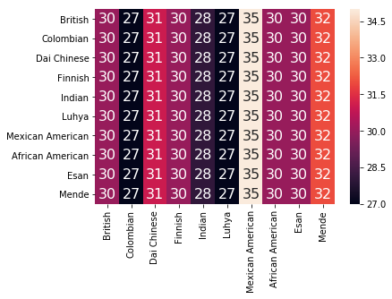

# Part 1: Data

Installing wget for downloading files from the internet:


```python
#!pip install wget
```

Define a function for reading the parts we are interested in from the fastq format:


```python
def readFastq(filename):
    sequences = []
    qualities = []
    with open(filename) as fh:
        while True:
            fh.readline() # skip name line
            seq = fh.readline().rstrip() # read base sequence
            fh.readline() # skip placeholder line
            qual = fh.readline().rstrip() #base quality line
            if len(seq) == 0:
                break
            sequences.append(seq)
            qualities.append(qual)
    return sequences, qualities
```

Download the files we'll work with.
Trying to geet as many different populations as possible without having rumtime problems.


```python
import wget
import gzip
import shutil
import os

data = [
    ['/HG00096/sequence_read/SRR062641.filt.fastq.gz', 'British', 'Male'],
    ['/HG01383/sequence_read/SRR100690.filt.fastq.gz', 'Colombian', 'Male'],
    ['/HG02410/sequence_read/SRR822161.filt.fastq.gz', 'Dai Chinese', 'Male'],
    ['/HG00188/sequence_read/SRR070795.filt.fastq.gz', 'Finnish', 'Male'],
    ['/HG03872/sequence_read/SRR792597.filt.fastq.gz', 'Indian', 'Male'],
    ['/NA19027/sequence_read/SRR701485.filt.fastq.gz', 'Luhya', 'Male'],
    ['/NA19685/sequence_read/SRR075441.filt.fastq.gz', 'Mexican American', 'Male'],
    ['/NA19700/sequence_read/SRR076015.filt.fastq.gz', 'African American', 'Male'],
    ['/HG03163/sequence_read/SRR788320.filt.fastq.gz', 'Esan', 'Male'],
    ['/HG02588/sequence_read/SRR580597.filt.fastq.gz', 'Mende', 'Male']
]

filenames = []
if not os.path.exists('resources'):
    os.mkdir('resources')
for i in range(len(data)):
    filename = wget.download('ftp://ftp.1000genomes.ebi.ac.uk/vol1/ftp/phase3/data/' + data[i][0])
    shutil.move(filename, 'resources/' + filename)
    filename = 'resources/' + filename
    filenames.append(filename)
    with gzip.open(filename, 'rb') as f, open(filename.replace('.gz',''), 'wb') as f1:
        file_content = f.read()
        f1.write(file_content)
```

    100% [............................................................................] 737176 / 737176

Load the sequences:


```python
seqs = []
quals = []

for filename in filenames:
    s, q = readFastq(filename.replace('.gz',''))
    seqs.append(s[:100])
    quals.append(q[:100])
shutil.rmtree('resources')
```

Create a dataframe:


```python
import pandas as pd
import numpy as np

all_seqs = []
all_quals = []
all_populations = []
all_genders = []

for i in range(len(data)):
    for j in range(len(seqs[i])):
        all_populations.append(data[i][1])
        all_genders.append(data[i][2])
    all_seqs.extend(seqs[i])
    all_quals.extend(quals[i])

df = pd.DataFrame({'Sequence' : np.array(all_seqs), 'Quals' : np.array(all_quals), 'Gender' : np.array(all_genders), 'Population' : np.array(all_populations)})
df
```


<div>
<style>
    .dataframe thead tr:only-child th {
        text-align: right;
    }

    .dataframe thead th {
        text-align: left;
    }

    .dataframe tbody tr th {
        vertical-align: top;
    }
</style>
<table border="1" class="dataframe">
  <thead>
    <tr style="text-align: right;">
      <th></th>
      <th>Gender</th>
      <th>Population</th>
      <th>Quals</th>
      <th>Sequence</th>
    </tr>
  </thead>
  <tbody>
    <tr>
      <th>0</th>
      <td>Male</td>
      <td>British</td>
      <td>@7:6+)=0577''3=?-&gt;&gt;;:A&gt;A######################...</td>
      <td>GAAAGAAAGAAAGTCAACTGTATGCTTAAAAATCCAAGTTGTGGGT...</td>
    </tr>
    <tr>
      <th>1</th>
      <td>Male</td>
      <td>British</td>
      <td>=@&gt;@6?&gt;A;AA?5?DDB5DD=DAD5-=?6@::A-ADDCD?C55,CB...</td>
      <td>AGACTTTATCAAATTATAACTGGGATTAGATAGACAGTCCAGAATA...</td>
    </tr>
    <tr>
      <th>2</th>
      <td>Male</td>
      <td>British</td>
      <td>@63=.50B;-C5A6A:5A?AD:DDD?6,,@6@&lt;)@###########...</td>
      <td>TTGAAGGATACAAAGTATTGATCCTGGGTGTGTCTGTGTGGGTGTT...</td>
    </tr>
    <tr>
      <th>3</th>
      <td>Male</td>
      <td>British</td>
      <td>CCC5?DDBD?DEEE5?EBEECDAE=EEDE=EEB:?D5?BBB5EECE...</td>
      <td>TGAGTCTCGTGTACCCATTCATTCATTTATTCATTCAGGTTAAGTT...</td>
    </tr>
    <tr>
      <th>4</th>
      <td>Male</td>
      <td>British</td>
      <td>?=A=B:'*&lt;=:-&lt;53,;;;&gt;5=B?&gt;BB:DD5-;9;C-C########...</td>
      <td>TAAAGAACAGTACCCTTGCCACAACTCAGGCACACTGATTTCCATG...</td>
    </tr>
    <tr>
      <th>5</th>
      <td>Male</td>
      <td>British</td>
      <td>A?=:5A=?B9:DC:?DBB?A===??=DB-=@ACC:-AA5A:B:AAD...</td>
      <td>TCTGCAAGTGGATATTCAGACATCCTTGAGGCTTTCGTTGGAAACG...</td>
    </tr>
    <tr>
      <th>6</th>
      <td>Male</td>
      <td>British</td>
      <td>?-C5;@;&gt;@-AA?A555=:-:D-D?-+=&gt;,CCC=:-5?C&lt;=A-CD?...</td>
      <td>TTGTTGGTTTTTTAATATGCAGCAAAACCAAAATCAGGGAAAGAAT...</td>
    </tr>
    <tr>
      <th>7</th>
      <td>Male</td>
      <td>British</td>
      <td>@&gt;C-;?CA55ABA?A5=?D:DCB=?C####################...</td>
      <td>TGAGTCATTGTTGGGGAAACCTCCCCCACGCCACCCAGTGGGTACC...</td>
    </tr>
    <tr>
      <th>8</th>
      <td>Male</td>
      <td>British</td>
      <td>D:DDA=DD?CC-5DDAAB5CCCCC-=7%/;*3&lt;B=AA:--5&amp;9==?...</td>
      <td>ATGATTCCATTCGATTCCGTTCAAAGACAATTCCATTCGAGTCCAT...</td>
    </tr>
    <tr>
      <th>9</th>
      <td>Male</td>
      <td>British</td>
      <td>CAAC?BD?B5D5@=BDD=@D5C:DB?D?AA);&gt;@############...</td>
      <td>AAGGGAACTGAAGTTTCTTCCATGTTGTTTACAGTATTACTTCAAA...</td>
    </tr>
    <tr>
      <th>10</th>
      <td>Male</td>
      <td>British</td>
      <td>=D=D5DDEAEDADEBCD5BBFF?FF?=EEEDB-BCBD,?,ECE=BE...</td>
      <td>AGAATGCAATGGACTTGAATGGAATGGACTGGAGAGGAATGGACTC...</td>
    </tr>
    <tr>
      <th>11</th>
      <td>Male</td>
      <td>British</td>
      <td>:DDDC=5&gt;==&lt;-AAA###############################...</td>
      <td>AGAACAAATACTGCGTGATTCTGTGTAAATGATGTTGAATTAATCT...</td>
    </tr>
    <tr>
      <th>12</th>
      <td>Male</td>
      <td>British</td>
      <td>AD?=BEDEE-?C:@=C-C:AABDDD?D:D=AAA)?;(:5?A-=&gt;CA...</td>
      <td>CGGCCCATTACCTACTCTGATCACAGCCTGCCCCGCTCAGCCCCTG...</td>
    </tr>
    <tr>
      <th>13</th>
      <td>Male</td>
      <td>British</td>
      <td>E=DDEDDEBDEEEEEEEB?EEE=EEEEEEDDEBEEEEEAED:@D=D...</td>
      <td>TCACTCTGCAATAGATCACTAAAGCTTATTCTTCCTAACTGAAGTT...</td>
    </tr>
    <tr>
      <th>14</th>
      <td>Male</td>
      <td>British</td>
      <td>DD:CDDD6=AC5ACCDD5DDD6&gt;BA?DA=?DBDC5C?=DBBBBB=@...</td>
      <td>CCAAATACAGTAACATTTTTCTATGTTTGTTAGAATTATCCTTTGT...</td>
    </tr>
    <tr>
      <th>15</th>
      <td>Male</td>
      <td>British</td>
      <td>=DDDDB=DDDD-A:5C:@C5DA=CBCC:DCDD===A&gt;-5:5A?A5B...</td>
      <td>TCAACATGAATATGCAGACGAAGACCTTTATGATGATCCACTTTCA...</td>
    </tr>
    <tr>
      <th>16</th>
      <td>Male</td>
      <td>British</td>
      <td>GDFGGGFA=FGGEGFEDGAE?EEECEEEBFFDEEGFEDFBFEA=D=...</td>
      <td>CTGCATCAATTAACTGGCAAAATAACCAGCTATCATCATAATGACA...</td>
    </tr>
    <tr>
      <th>17</th>
      <td>Male</td>
      <td>British</td>
      <td>DDDDDDD?DD-C:CCDD58A::3==B6@B@DDBDDABDBCDDBBBA...</td>
      <td>TCTTCTGTGTAGTTTTTATGTGAAGATATTTGCTTTTCCATAATAG...</td>
    </tr>
    <tr>
      <th>18</th>
      <td>Male</td>
      <td>British</td>
      <td>??-5666A:A6@4=C@,@@-7)&lt;5?25;)67@##############...</td>
      <td>GGGAGGCCAAGGCTGGTGTATGGTGAGACCAGCCTGAGCAAAATAG...</td>
    </tr>
    <tr>
      <th>19</th>
      <td>Male</td>
      <td>British</td>
      <td>55:?=@DDA-:B5=&gt;=C=CAA-A?5-AA&gt;A.==&gt;=A?AAA&lt;.+:=C...</td>
      <td>TGCCATTGTTGATGCAGGTTGAGCACTCCTACATTTTTGGTTCAGG...</td>
    </tr>
    <tr>
      <th>20</th>
      <td>Male</td>
      <td>British</td>
      <td>5A5BDDDD5DDDDA?DC?D=C:C-C=.;6&gt;:?-AAD=DD5-=:DD?...</td>
      <td>AGAAACTCACTCTTATGAGAGCCTGGATTCACATTAATGGAAATCA...</td>
    </tr>
    <tr>
      <th>21</th>
      <td>Male</td>
      <td>British</td>
      <td>=&gt;B-=-&gt;@@@?=?B::DDD6DDDD-:7-?:;&gt;@@B@C9@25;,:;=...</td>
      <td>TAATTTGCAGCATCTAAAAATTTGAAGCTGTCACTTAAGAACTTAG...</td>
    </tr>
    <tr>
      <th>22</th>
      <td>Male</td>
      <td>British</td>
      <td>:DDDB:5C5CDBDD:DD?&gt;B64@@CDCDCDBDAC=BD;&gt;=ADDB=D...</td>
      <td>CAACCACTATGGAAAACAGTATGGAGATTCCTTAAATAACCAAAAG...</td>
    </tr>
    <tr>
      <th>23</th>
      <td>Male</td>
      <td>British</td>
      <td>-::BD=5?9=&lt;DD:D=;=:7&gt;:?A:&gt;=&gt;?@;;-=@C5AAADDDDAC...</td>
      <td>AGCTCTTTGGGTTTTTTGTGGTTCCATACAAATGTTAGTATTTTTT...</td>
    </tr>
    <tr>
      <th>24</th>
      <td>Male</td>
      <td>British</td>
      <td>##############################################...</td>
      <td>CCGGGGGGCCGGGGGCCCGGGGGCAATAAAGTAGAAACCCCCCCGG...</td>
    </tr>
    <tr>
      <th>25</th>
      <td>Male</td>
      <td>British</td>
      <td>@&gt;@&gt;C5:CCC:EB=B?EBCEGGEG=A:DEEDE-BEGDD:AE=BBCE...</td>
      <td>TGGTCCAATCAGAGTTTCTCCCTGGGATCCATATATGCACAGTGAG...</td>
    </tr>
    <tr>
      <th>26</th>
      <td>Male</td>
      <td>British</td>
      <td>EEEEE=5BE:CE?BCEDBD@B=@@B??D?CBECBB?B5B?@B-@5:...</td>
      <td>GCTTGAACCCAGGAATCAGAGGTTGCAGTGAGCCGAGATCACACCA...</td>
    </tr>
    <tr>
      <th>27</th>
      <td>Male</td>
      <td>British</td>
      <td>DDDCBDDDDDDDBDBDDB=DDBADABCDCDBBDBCBBDDDDCCAAC...</td>
      <td>CTCAAGGTTTTTAGTTTAATTAAGTTCTATCTGTCTATTTTTGTTT...</td>
    </tr>
    <tr>
      <th>28</th>
      <td>Male</td>
      <td>British</td>
      <td>EEEA?DBEEEEEEBEDE??EEDEEEEEEEDDBEEE=EAEEEDEBAE...</td>
      <td>AAAAAAGATAATACAGAAATGTTATGAACAAATCCATGTCAATAAA...</td>
    </tr>
    <tr>
      <th>29</th>
      <td>Male</td>
      <td>British</td>
      <td>FFDDDC-?AACCC5C=EEAD-=&gt;?C=&gt;?,,&gt;?,?@53(AC######...</td>
      <td>TCCCCGTCATTTCCTCCCGGAGTCGTCGCAGGGGGAGATGGACAAC...</td>
    </tr>
    <tr>
      <th>...</th>
      <td>...</td>
      <td>...</td>
      <td>...</td>
      <td>...</td>
    </tr>
    <tr>
      <th>970</th>
      <td>Male</td>
      <td>Mende</td>
      <td>?@;+422ADFAH8&lt;?&lt;A,A,AFG3F+??H39?AAEFHC@)6DD###...</td>
      <td>GCAGGTTTTCATTATTTCCAACTCACACTATACCTTGGGGGTTCGT...</td>
    </tr>
    <tr>
      <th>971</th>
      <td>Male</td>
      <td>Mende</td>
      <td>@CCFFFFFHFHHFJIIIJGIIJJJJIGIHJIJJ&lt;EHIHIIIIIJJH...</td>
      <td>TCACTTGACAAAATTCTTACCAAAGAGCAAGAGTCCCTTATTAAGT...</td>
    </tr>
    <tr>
      <th>972</th>
      <td>Male</td>
      <td>Mende</td>
      <td>CCCFFFFFHGHHHJIJIEHIHHIJIJJJIJJIJJGJJIJIGIIIDG...</td>
      <td>TTTCAGCCTACAAGGCTCGGTTAAGAGGCTTCCTCCTGTCTGTCGC...</td>
    </tr>
    <tr>
      <th>973</th>
      <td>Male</td>
      <td>Mende</td>
      <td>B@@FFEFFHHHHHJJJJHIIIJJJJJJJJIJIJJJJJJIJJIIJDH...</td>
      <td>TCAGGTTTTTGCTCTTTCGAGCACTGCTGCGCCTGTCTCTGTGGAT...</td>
    </tr>
    <tr>
      <th>974</th>
      <td>Male</td>
      <td>Mende</td>
      <td>@CCFFFDD?FHHHJGGIJJEHJIEJIJHHGIJGIHIICFCEI?FFH...</td>
      <td>AGCAGAACCAAAATGTCCCATTACTTTCCCGGAAGTTCATGGTGAC...</td>
    </tr>
    <tr>
      <th>975</th>
      <td>Male</td>
      <td>Mende</td>
      <td>@@CFFFFFHHHHHJJJIIIGGIGGIJGGGGGFGIIJGIGGIIIIJJ...</td>
      <td>GATGATGAAAAAGGGGCTGAGGAAGGAGAGGATGACAGAGACAGGG...</td>
    </tr>
    <tr>
      <th>976</th>
      <td>Male</td>
      <td>Mende</td>
      <td>?&lt;?DB?DDDFF?FHB:2ADFHBFFC=2AEEIG&gt;FEDEHEH;D?D;B...</td>
      <td>ACAACTGCCCTGACTGTGGCAACAGGTCATTTTATGACCTGGAGGC...</td>
    </tr>
    <tr>
      <th>977</th>
      <td>Male</td>
      <td>Mende</td>
      <td>CCCFFFFFHHHHHJIJGIIHIJJJJJJIEHIEHHGIGHIJJCGIGI...</td>
      <td>GTCTATGATGCCACAGTCATCTAAATCCAGGTACTCAAGGGTGGCT...</td>
    </tr>
    <tr>
      <th>978</th>
      <td>Male</td>
      <td>Mende</td>
      <td>?&lt;+B;DDFHF+&lt;AGG&gt;+23&lt;F?CE;?3CC@&lt;CGDEHD9C9DC0?B2...</td>
      <td>GATGCATCCTGAAAATGGTGAACCTAGACTGTATCCAGGAGGTGGA...</td>
    </tr>
    <tr>
      <th>979</th>
      <td>Male</td>
      <td>Mende</td>
      <td>1:+++2+2=++?AC:++&lt;@F;++2&lt;3:C3C*CFGC4BF*??&lt;&lt;D&lt;&lt;...</td>
      <td>GTACAGGTGGCCTTCGAGGAAAGAAACAGAGTTCATATAAAGCTTT...</td>
    </tr>
    <tr>
      <th>980</th>
      <td>Male</td>
      <td>Mende</td>
      <td>BB@DDFDFH:CFHHGIEGHHJIIG;C)?FDGIGHDFEHEFHGGGGI...</td>
      <td>CTCTTCCGGTGGGTTTACCAAAGGAGAGGTTTAGTACACCTGTGCT...</td>
    </tr>
    <tr>
      <th>981</th>
      <td>Male</td>
      <td>Mende</td>
      <td>CCCFFFDFHHGDHIJJIJJIFH&gt;HGHGCDIGIIIGIIGDBFEHIJG...</td>
      <td>TAGGCAGGCATTCAACAGCAGTATTGATCTGCCTCCAGGTCATAAA...</td>
    </tr>
    <tr>
      <th>982</th>
      <td>Male</td>
      <td>Mende</td>
      <td>CCCFFFFDHHHHHJJJIJHJIJJJJJJFHIHGFHIGIJJGGHGIJJ...</td>
      <td>AAAAAACCAGTGCAGGACTGTCCAAGGATGAGAGGACAGCAGCCCT...</td>
    </tr>
    <tr>
      <th>983</th>
      <td>Male</td>
      <td>Mende</td>
      <td>@@@FFFDD?FDHHCGGHIG@GHGHGAEHECFEGGBGFHE?FGHG?H...</td>
      <td>CCAAAGTAGAAGGTGGTGAGCTGGGAGCAGCGGCTCAGGCCAGGCA...</td>
    </tr>
    <tr>
      <th>984</th>
      <td>Male</td>
      <td>Mende</td>
      <td>??;ADD?:2CFFHGJ&gt;FHG@GBF&lt;??@8DH31BGHGB;F??(?/7C...</td>
      <td>CAAGATGAGCATCAGGGCCCCACCCAGACTCCTGGAGCTGGCAAGG...</td>
    </tr>
    <tr>
      <th>985</th>
      <td>Male</td>
      <td>Mende</td>
      <td>=??DB+2=2A?,&lt;:&lt;C1C+A+&lt;3&lt;CFCD9GHHC*?F:CDG@?D1*9...</td>
      <td>AATTAGTAATTTCCCCCAATGGTAGGAAAAGTTCTGTGGGCAGCTC...</td>
    </tr>
    <tr>
      <th>986</th>
      <td>Male</td>
      <td>Mende</td>
      <td>@??DDBBDFDF8DFGHGIEEBHGIIIGCF9F@GHGEEFD**??8?D...</td>
      <td>GGGCTTCATATGCTGCTTACACAGAAGGATCGCCCCAGGTGAGGTG...</td>
    </tr>
    <tr>
      <th>987</th>
      <td>Male</td>
      <td>Mende</td>
      <td>&lt;???=BDD?BD+&lt;2AEB9FF:?@?AB&lt;E*:?ECGG&gt;G@F9:F??::...</td>
      <td>AGGGTCTGAAGAGTGGCAGCAACTTTCTCTAGCAGAGCTCGGAGGG...</td>
    </tr>
    <tr>
      <th>988</th>
      <td>Male</td>
      <td>Mende</td>
      <td>@@@DDFFBFFHHHJJJJIJIIJHGEHIJJJJJJJIJIIJJJJJJIJ...</td>
      <td>CTGAGGGTAGTACAGGCAGAGGAATGGACAGTCCAAGTCAGGAACG...</td>
    </tr>
    <tr>
      <th>989</th>
      <td>Male</td>
      <td>Mende</td>
      <td>CCCFFFFFGHHGHJIJJIJJJGIJIJJJJJGHGGHIFHIJJJJJIJ...</td>
      <td>CCCCGGCCCCGACCAGCACGTAGGCCACAGAGAAGGTCTTGCTCTT...</td>
    </tr>
    <tr>
      <th>990</th>
      <td>Male</td>
      <td>Mende</td>
      <td>B@@DD&gt;BAHA?FHBG@GIGCHHIEIGHH@CFHGIGEFGG&gt;BFHIEI...</td>
      <td>CACCTGCAGCCCTCTCTTGTAGAAAATGGTGCTGGCTTTGCTGGAG...</td>
    </tr>
    <tr>
      <th>991</th>
      <td>Male</td>
      <td>Mende</td>
      <td>@@BFFB&gt;DHHHHHJHIHGIHHEGFIGHIGGIIFGHGHGIGIIIGGG...</td>
      <td>CCCTGCCATCAGGGATTGGTTATAAAGTTTTGTCTTTTTGTTGTGC...</td>
    </tr>
    <tr>
      <th>992</th>
      <td>Male</td>
      <td>Mende</td>
      <td>@@BFFFFFHHBHFGHGIIIFHHGIGAGDFHCFGGAE&gt;GIIJDGFHC...</td>
      <td>AAAGCCTGAACGATGACAGTGCCGAAGAGGATGAAGAGGGCAGAGA...</td>
    </tr>
    <tr>
      <th>993</th>
      <td>Male</td>
      <td>Mende</td>
      <td>=:1AD#########################################...</td>
      <td>TACTTGGGAACTGCGCTGGAGGTCGAGGGGCTGCATTCTCCTTCTG...</td>
    </tr>
    <tr>
      <th>994</th>
      <td>Male</td>
      <td>Mende</td>
      <td>@CBFFFFFHHHHHHIIJJIIJJJJJJHIIJJJJIIJJJJJIJJIJH...</td>
      <td>TGCCACTACCCCCAGCTAATTTTTTGTATTGTTAGTAGAGATGGGA...</td>
    </tr>
    <tr>
      <th>995</th>
      <td>Male</td>
      <td>Mende</td>
      <td>C@BFFFFFHHHHHIJJIIGJJJJJJJIJJJIHIJJJJGIJJJIJIJ...</td>
      <td>CCCACTCTGTCCCTAGCCACACCAGGAGCTGAAGCCATGGCCTCAA...</td>
    </tr>
    <tr>
      <th>996</th>
      <td>Male</td>
      <td>Mende</td>
      <td>B@CFFFEFGHFHDIIJJJJHGGIJJJJHEHDHII?GGHIJJGIIJJ...</td>
      <td>CTTTTTCCAGAGATGAAAGCAACTGGGAAGTGGGTGCAGGGACTGC...</td>
    </tr>
    <tr>
      <th>997</th>
      <td>Male</td>
      <td>Mende</td>
      <td>?@@DDEFDFHFFFFE@FHHIIIJJEIIFGGGBGGIJIJJGGIHGGI...</td>
      <td>TTGTCACTGGAGGTGCTGTTTTTTCTTCTAAAGGCTTTTTAGAGTC...</td>
    </tr>
    <tr>
      <th>998</th>
      <td>Male</td>
      <td>Mende</td>
      <td>@@CFFFFFHGHHHJBHIJJIIIHIJGGJIIJIIGIJJGIJIIJHHH...</td>
      <td>TCTGCGGCGTCCTGAGCTGTGCTTACCTCTTCTGTCAGCGAACCTT...</td>
    </tr>
    <tr>
      <th>999</th>
      <td>Male</td>
      <td>Mende</td>
      <td>?8?+AADDCD&lt;CBA,A?A&gt;AEFAB@BF)1:9??DD))60)0BD*/*...</td>
      <td>GTTCTCCCCGTTACTTCATGCAGGGAAGTCTCTGGGGACAGCTTCA...</td>
    </tr>
  </tbody>
</table>
<p>1000 rows × 4 columns</p>
</div>


# Part 2: Classification

We'll be using the feature_extraction module from scikit-learn to create bag-of-words features. 
CountVectorizer comes with its own options to automatically do preprocessing, tokenization, and stop word removal -- for each of these, instead of specifying "None", we could have used a built-in method or specified our own function to use. See the function documentation for more details. However, we wanted to write our own function for data cleaning in this lecture to show you how it's done step by step.


```python
from sklearn.feature_extraction.text import CountVectorizer

def get_train_data_features(s):
    vectorizer = CountVectorizer(analyzer = "char",
                                 tokenizer = None,
                                 preprocessor = None,
                                 stop_words = None,
                                 max_features = 5000) 
    train_data_features = vectorizer.fit_transform(s)
    return train_data_features.toarray()

train_data_features = get_train_data_features(all_seqs)
```

Split the data into train and test sets:


```python
msk = np.random.rand(len(train_data_features)) < 0.8

train_x = train_data_features[msk]
test_x = train_data_features[~msk]
train_y = df.loc[msk, 'Population']
test_y = df.loc[~msk, 'Population']
```

We'll examine 3 algorithms which used in previous assignments.

## RandomForest:
Random Forest is an ensemble learning method for classification, regression and other tasks, that operate by constructing a multitude of decision trees at training time and outputting the class that is the mode of the classes (classification) or mean prediction (regression) of the individual trees. Random decision forests correct for decision trees' habit of overfitting to their training set.


```python
from sklearn.ensemble import RandomForestClassifier

rf = RandomForestClassifier(n_estimators = 100) 
rf = rf.fit(train_x, train_y)
rf_score = rf.score(test_x,test_y)

rf_score
```


    0.4020618556701031


## K Nearest Neighbors:
k-nearest neighbors algorithm (k-NN) is a non-parametric method used for classification and regression.
In both cases, the input consists of the k closest training examples in the feature space.
The output depends on whether k-NN is used for classification or regression


```python
from sklearn.neighbors import KNeighborsClassifier

knn = KNeighborsClassifier(n_neighbors = 13, weights = 'uniform')
knn = knn.fit( train_x, train_y)
knn_score = knn.score(test_x,test_y)

knn_score
```


    0.35051546391752575


## Adaptive Boosting:
AdaBoost, short for Adaptive Boosting, is a machine learning meta-algorithm formulated by Yoav Freund and Robert Schapire, who won the 2003 Gödel Prize for their work. It can be used in conjunction with many other types of learning algorithms to improve performance.
The output of the other learning algorithms ('weak learners') is combined into a weighted sum that represents the final output of the boosted classifier.


```python
from sklearn.ensemble import AdaBoostClassifier

ab = AdaBoostClassifier(n_estimators=100)
ab = ab.fit(train_x, train_y)

ab_score = ab.score(test_x, test_y)

ab_score
```


    0.3402061855670103


As we can see, RandomForest provides the best results.
Therefore we'll use the rf method when we get to part 4.

# Part 3: Text Generation

Start by installing and importing keras and relevant libraries.


```python
#!pip install keras==1.2
```


```python
import numpy
import theano
```

    WARNING (theano.configdefaults): g++ not available, if using conda: `conda install m2w64-toolchain`
    C:\Users\Tal\Anaconda3\lib\site-packages\theano\configdefaults.py:560: UserWarning: DeprecationWarning: there is no c++ compiler.This is deprecated and with Theano 0.11 a c++ compiler will be mandatory
      warnings.warn("DeprecationWarning: there is no c++ compiler."
    WARNING (theano.configdefaults): g++ not detected ! Theano will be unable to execute optimized C-implementations (for both CPU and GPU) and will default to Python implementations. Performance will be severely degraded. To remove this warning, set Theano flags cxx to an empty string.
    WARNING (theano.tensor.blas): Using NumPy C-API based implementation for BLAS functions.
    


```python
import keras 
print(keras.__version__)
```

    1.2.0
    

    Using Theano backend.
    


```python
from keras import backend as K
K.set_image_dim_ordering('th')
```

We have some text preprocessing functions in keras preprocessing.text module.
text_to_word_sequence splits a sentence into a list of words. In this task we model the language as a sequence of words, so we use this function to split the entire text to a list of words, in its original order. There are some parameters that allows to filter some unrelevant stuff and control the splitting:


```python
from keras.preprocessing.text import text_to_word_sequence

seqs_preprocessed = []
for s in seqs:
    seqs_preprocessed.append(text_to_word_sequence(" ".join(s), lower=False, split=" "))
    
```

Tokenizer is a class for vectorizing texts, or/and turning texts into sequences (=list of word indexes, where the word of rank i in the dataset (starting at 1) has index i). It considers the vocabulary size (nb_words) for indexing most frequent words, otherwise using the unknown-token index.


```python
from keras.preprocessing.text import Tokenizer
from keras.models import Sequential
from keras.layers.core import Dense, Activation, Flatten
from keras.layers.wrappers import TimeDistributed
from keras.layers.embeddings import Embedding
from keras.layers.recurrent import LSTM
from keras.layers.embeddings import Embedding
from keras.layers.recurrent import SimpleRNN

tokens = []

for i in range(10):
    tokenizer = Tokenizer(nb_words=100,char_level=False)
    tokenizer.fit_on_texts(seqs_preprocessed[i])

    tokens.append(tokenizer)
```

We represent each word as a one-hot vector of size vocabulary_size. For example, the word with index 36 would be the vector of all 0’s and a 1 at position 36. So, each word will become a vector, and the input will be a matrix, with each row representing a word.

texts_to_matrix performs this conversion for us when setting the mode parameter to 'binary'.


```python
text_mtxs = []
inputs_ = []
outputs_ = []
vocabs = []

for i in range(10):
    text_mtx = tokens[i].texts_to_matrix(seqs_preprocessed[i], mode='binary')
    
    input_ = text_mtx[:-1]
    output_ = text_mtx[1:]
    
    vocab = pd.DataFrame({'word':seqs_preprocessed[i],'code':np.argmax(text_mtx,axis=1)})
    
    text_mtxs.append(text_mtx)
    inputs_.append(input_)
    outputs_.append(output_)
    vocabs.append(vocab)
    
```

Declaring a sequential model format, which is a linear stack of neural network layers.
Next, we can simply add more layers to our model like we're building legos:
We start by adding an embedding layer, that turns positive integers (indexes) into dense vectors of fixed size.
This layer can only be used as the first layer in a model.
Then, connect it to a dense output layer, by first flattening the result, and then passing it to the output layer:


```python
models = []
scores = []
for i in range(10):
    model = Sequential()
    model.add(Embedding(input_dim=inputs_[i].shape[1],output_dim=42, input_length=inputs_[i].shape[1]))
    model.add(Flatten())
    model.add(Dense(outputs_[i].shape[1], activation='sigmoid'))
    
    model.compile(loss='categorical_crossentropy', optimizer='rmsprop',metrics=["accuracy"])
    model.fit(inputs_[i], y=outputs_[i], batch_size=200, nb_epoch=10, verbose=1, validation_split=0.2)
    score = model.evaluate(inputs_[i],outputs_[i], verbose=0)
    
    models.append(model)
    scores.append(score)
```

    Train on 79 samples, validate on 20 samples
    Epoch 1/10
    79/79 [==============================] - 14s - loss: 4.6063 - acc: 0.0127 - val_loss: 4.6191 - val_acc: 0.0000e+00
    Epoch 2/10
    79/79 [==============================] - 14s - loss: 4.5441 - acc: 0.0253 - val_loss: 4.8382 - val_acc: 0.0000e+00
    Epoch 3/10
    79/79 [==============================] - 14s - loss: 4.5030 - acc: 0.0253 - val_loss: 5.0616 - val_acc: 0.0000e+00
    Epoch 4/10
    79/79 [==============================] - 15s - loss: 4.4711 - acc: 0.0253 - val_loss: 5.2834 - val_acc: 0.0000e+00
    Epoch 5/10
    79/79 [==============================] - 14s - loss: 4.4468 - acc: 0.0380 - val_loss: 5.4987 - val_acc: 0.0000e+00
    Epoch 6/10
    79/79 [==============================] - 14s - loss: 4.4284 - acc: 0.0633 - val_loss: 5.7036 - val_acc: 0.0000e+00
    Epoch 7/10
    79/79 [==============================] - 14s - loss: 4.4145 - acc: 0.1392 - val_loss: 5.8964 - val_acc: 0.0000e+00
    Epoch 8/10
    79/79 [==============================] - 14s - loss: 4.4040 - acc: 0.2405 - val_loss: 6.0763 - val_acc: 0.0000e+00
    Epoch 9/10
    79/79 [==============================] - 14s - loss: 4.3958 - acc: 0.3418 - val_loss: 6.2436 - val_acc: 0.0000e+00
    Epoch 10/10
    79/79 [==============================] - 14s - loss: 4.3894 - acc: 0.4177 - val_loss: 6.3990 - val_acc: 0.0000e+00
    Train on 79 samples, validate on 20 samples
    Epoch 1/10
    79/79 [==============================] - 14s - loss: 4.6046 - acc: 0.0127 - val_loss: 4.6403 - val_acc: 0.0000e+00
    Epoch 2/10
    79/79 [==============================] - 14s - loss: 4.5389 - acc: 0.0253 - val_loss: 4.8724 - val_acc: 0.0000e+00
    Epoch 3/10
    79/79 [==============================] - 14s - loss: 4.4972 - acc: 0.0253 - val_loss: 5.1048 - val_acc: 0.0000e+00
    Epoch 4/10
    79/79 [==============================] - 15s - loss: 4.4659 - acc: 0.0253 - val_loss: 5.3330 - val_acc: 0.0000e+00
    Epoch 5/10
    79/79 [==============================] - 15s - loss: 4.4424 - acc: 0.0380 - val_loss: 5.5525 - val_acc: 0.0000e+00
    Epoch 6/10
    79/79 [==============================] - 14s - loss: 4.4250 - acc: 0.0633 - val_loss: 5.7600 - val_acc: 0.0000e+00
    Epoch 7/10
    79/79 [==============================] - 15s - loss: 4.4120 - acc: 0.0633 - val_loss: 5.9540 - val_acc: 0.0000e+00
    Epoch 8/10
    79/79 [==============================] - 14s - loss: 4.4021 - acc: 0.1139 - val_loss: 6.1345 - val_acc: 0.0000e+00
    Epoch 9/10
    79/79 [==============================] - 14s - loss: 4.3945 - acc: 0.0886 - val_loss: 6.3018 - val_acc: 0.0000e+00
    Epoch 10/10
    79/79 [==============================] - 14s - loss: 4.3885 - acc: 0.0633 - val_loss: 6.4569 - val_acc: 0.0000e+00
    Train on 79 samples, validate on 20 samples
    Epoch 1/10
    79/79 [==============================] - 14s - loss: 4.6075 - acc: 0.0000e+00 - val_loss: 4.8260 - val_acc: 0.0000e+00
    Epoch 2/10
    79/79 [==============================] - 14s - loss: 4.5478 - acc: 0.0127 - val_loss: 5.0343 - val_acc: 0.0000e+00
    Epoch 3/10
    79/79 [==============================] - 14s - loss: 4.5066 - acc: 0.0127 - val_loss: 5.2521 - val_acc: 0.0000e+00
    Epoch 4/10
    79/79 [==============================] - 14s - loss: 4.4732 - acc: 0.0253 - val_loss: 5.4726 - val_acc: 0.0000e+00
    Epoch 5/10
    79/79 [==============================] - 14s - loss: 4.4469 - acc: 0.0253 - val_loss: 5.6902 - val_acc: 0.0000e+00
    Epoch 6/10
    79/79 [==============================] - 15s - loss: 4.4264 - acc: 0.0253 - val_loss: 5.9008 - val_acc: 0.0000e+00
    Epoch 7/10
    79/79 [==============================] - 14s - loss: 4.4107 - acc: 0.0253 - val_loss: 6.1014 - val_acc: 0.0000e+00
    Epoch 8/10
    79/79 [==============================] - 14s - loss: 4.3986 - acc: 0.0253 - val_loss: 6.2906 - val_acc: 0.0000e+00
    Epoch 9/10
    79/79 [==============================] - 15s - loss: 4.3892 - acc: 0.0253 - val_loss: 6.4678 - val_acc: 0.0000e+00
    Epoch 10/10
    79/79 [==============================] - 14s - loss: 4.3817 - acc: 0.0253 - val_loss: 6.6331 - val_acc: 0.0000e+00
    Train on 79 samples, validate on 20 samples
    Epoch 1/10
    79/79 [==============================] - 14s - loss: 4.6060 - acc: 0.0127 - val_loss: 4.6519 - val_acc: 0.0000e+00
    Epoch 2/10
    79/79 [==============================] - 14s - loss: 4.5376 - acc: 0.0253 - val_loss: 4.8863 - val_acc: 0.0000e+00
    Epoch 3/10
    79/79 [==============================] - 14s - loss: 4.4957 - acc: 0.0380 - val_loss: 5.1186 - val_acc: 0.0000e+00
    Epoch 4/10
    79/79 [==============================] - 14s - loss: 4.4644 - acc: 0.0506 - val_loss: 5.3450 - val_acc: 0.0000e+00
    Epoch 5/10
    79/79 [==============================] - 14s - loss: 4.4410 - acc: 0.1139 - val_loss: 5.5621 - val_acc: 0.0000e+00
    Epoch 6/10
    79/79 [==============================] - 14s - loss: 4.4236 - acc: 0.2025 - val_loss: 5.7674 - val_acc: 0.0000e+00
    Epoch 7/10
    79/79 [==============================] - 14s - loss: 4.4106 - acc: 0.3165 - val_loss: 5.9598 - val_acc: 0.0000e+00
    Epoch 8/10
    79/79 [==============================] - 14s - loss: 4.4006 - acc: 0.3038 - val_loss: 6.1389 - val_acc: 0.0000e+00
    Epoch 9/10
    79/79 [==============================] - 15s - loss: 4.3929 - acc: 0.3165 - val_loss: 6.3052 - val_acc: 0.0000e+00
    Epoch 10/10
    79/79 [==============================] - 14s - loss: 4.3867 - acc: 0.3165 - val_loss: 6.4593 - val_acc: 0.0000e+00
    Train on 79 samples, validate on 20 samples
    Epoch 1/10
    79/79 [==============================] - 14s - loss: 4.6054 - acc: 0.0000e+00 - val_loss: 4.6148 - val_acc: 0.0000e+00
    Epoch 2/10
    79/79 [==============================] - 14s - loss: 4.5437 - acc: 0.0253 - val_loss: 4.8308 - val_acc: 0.0000e+00
    Epoch 3/10
    79/79 [==============================] - 14s - loss: 4.5027 - acc: 0.0633 - val_loss: 5.0499 - val_acc: 0.0000e+00
    Epoch 4/10
    79/79 [==============================] - 14s - loss: 4.4709 - acc: 0.1139 - val_loss: 5.2672 - val_acc: 0.0000e+00
    Epoch 5/10
    79/79 [==============================] - 14s - loss: 4.4466 - acc: 0.1772 - val_loss: 5.4788 - val_acc: 0.0000e+00
    Epoch 6/10
    79/79 [==============================] - 14s - loss: 4.4281 - acc: 0.2152 - val_loss: 5.6814 - val_acc: 0.0000e+00
    Epoch 7/10
    79/79 [==============================] - 14s - loss: 4.4141 - acc: 0.2911 - val_loss: 5.8727 - val_acc: 0.0000e+00
    Epoch 8/10
    79/79 [==============================] - 15s - loss: 4.4033 - acc: 0.4304 - val_loss: 6.0520 - val_acc: 0.0000e+00
    Epoch 9/10
    79/79 [==============================] - 14s - loss: 4.3949 - acc: 0.4430 - val_loss: 6.2189 - val_acc: 0.0000e+00
    Epoch 10/10
    79/79 [==============================] - 14s - loss: 4.3882 - acc: 0.5190 - val_loss: 6.3741 - val_acc: 0.0000e+00
    Train on 79 samples, validate on 20 samples
    Epoch 1/10
    79/79 [==============================] - 14s - loss: 4.6049 - acc: 0.0127 - val_loss: 4.6263 - val_acc: 0.0000e+00
    Epoch 2/10
    79/79 [==============================] - 14s - loss: 4.5425 - acc: 0.0127 - val_loss: 4.8490 - val_acc: 0.0000e+00
    Epoch 3/10
    79/79 [==============================] - 15s - loss: 4.5012 - acc: 0.0253 - val_loss: 5.0749 - val_acc: 0.0000e+00
    Epoch 4/10
    79/79 [==============================] - 14s - loss: 4.4692 - acc: 0.0253 - val_loss: 5.2983 - val_acc: 0.0000e+00
    Epoch 5/10
    79/79 [==============================] - 14s - loss: 4.4450 - acc: 0.0759 - val_loss: 5.5142 - val_acc: 0.0000e+00
    Epoch 6/10
    79/79 [==============================] - 14s - loss: 4.4268 - acc: 0.0886 - val_loss: 5.7191 - val_acc: 0.0000e+00
    Epoch 7/10
    79/79 [==============================] - 15s - loss: 4.4131 - acc: 0.1392 - val_loss: 5.9113 - val_acc: 0.0000e+00
    Epoch 8/10
    79/79 [==============================] - 14s - loss: 4.4027 - acc: 0.1646 - val_loss: 6.0904 - val_acc: 0.0000e+00
    Epoch 9/10
    79/79 [==============================] - 15s - loss: 4.3947 - acc: 0.1899 - val_loss: 6.2567 - val_acc: 0.0000e+00
    Epoch 10/10
    79/79 [==============================] - 14s - loss: 4.3883 - acc: 0.2278 - val_loss: 6.4110 - val_acc: 0.0000e+00
    Train on 79 samples, validate on 20 samples
    Epoch 1/10
    79/79 [==============================] - 14s - loss: 4.6069 - acc: 0.0127 - val_loss: 4.6339 - val_acc: 0.0000e+00
    Epoch 2/10
    79/79 [==============================] - 14s - loss: 4.5403 - acc: 0.0127 - val_loss: 4.8614 - val_acc: 0.0000e+00
    Epoch 3/10
    79/79 [==============================] - 14s - loss: 4.4985 - acc: 0.0127 - val_loss: 5.0891 - val_acc: 0.0000e+00
    Epoch 4/10
    79/79 [==============================] - 14s - loss: 4.4668 - acc: 0.0127 - val_loss: 5.3130 - val_acc: 0.0000e+00
    Epoch 5/10
    79/79 [==============================] - 14s - loss: 4.4430 - acc: 0.0633 - val_loss: 5.5289 - val_acc: 0.0000e+00
    Epoch 6/10
    79/79 [==============================] - 15s - loss: 4.4252 - acc: 0.0633 - val_loss: 5.7337 - val_acc: 0.0000e+00
    Epoch 7/10
    79/79 [==============================] - 14s - loss: 4.4118 - acc: 0.0633 - val_loss: 5.9258 - val_acc: 0.0000e+00
    Epoch 8/10
    79/79 [==============================] - 14s - loss: 4.4015 - acc: 0.1013 - val_loss: 6.1048 - val_acc: 0.0000e+00
    Epoch 9/10
    79/79 [==============================] - 14s - loss: 4.3936 - acc: 0.1392 - val_loss: 6.2709 - val_acc: 0.0000e+00
    Epoch 10/10
    79/79 [==============================] - 15s - loss: 4.3873 - acc: 0.1899 - val_loss: 6.4248 - val_acc: 0.0000e+00
    Train on 79 samples, validate on 20 samples
    Epoch 1/10
    79/79 [==============================] - 14s - loss: 4.6063 - acc: 0.0127 - val_loss: 4.5942 - val_acc: 0.0000e+00
    Epoch 2/10
    79/79 [==============================] - 14s - loss: 4.5494 - acc: 0.0127 - val_loss: 4.7942 - val_acc: 0.0000e+00
    Epoch 3/10
    79/79 [==============================] - 14s - loss: 4.5102 - acc: 0.0127 - val_loss: 5.0002 - val_acc: 0.0000e+00
    Epoch 4/10
    79/79 [==============================] - 14s - loss: 4.4788 - acc: 0.0253 - val_loss: 5.2082 - val_acc: 0.0000e+00
    Epoch 5/10
    79/79 [==============================] - 15s - loss: 4.4541 - acc: 0.0380 - val_loss: 5.4141 - val_acc: 0.0000e+00
    Epoch 6/10
    79/79 [==============================] - 14s - loss: 4.4348 - acc: 0.0506 - val_loss: 5.6143 - val_acc: 0.0000e+00
    Epoch 7/10
    79/79 [==============================] - 14s - loss: 4.4199 - acc: 0.0886 - val_loss: 5.8059 - val_acc: 0.0000e+00
    Epoch 8/10
    79/79 [==============================] - 14s - loss: 4.4084 - acc: 0.1899 - val_loss: 5.9870 - val_acc: 0.0000e+00
    Epoch 9/10
    79/79 [==============================] - 14s - loss: 4.3994 - acc: 0.2405 - val_loss: 6.1571 - val_acc: 0.0000e+00
    Epoch 10/10
    79/79 [==============================] - 14s - loss: 4.3923 - acc: 0.1772 - val_loss: 6.3161 - val_acc: 0.0000e+00
    Train on 79 samples, validate on 20 samples
    Epoch 1/10
    79/79 [==============================] - 15s - loss: 4.6066 - acc: 0.0127 - val_loss: 4.6654 - val_acc: 0.0000e+00
    Epoch 2/10
    79/79 [==============================] - 15s - loss: 4.5350 - acc: 0.0127 - val_loss: 4.9061 - val_acc: 0.0000e+00
    Epoch 3/10
    79/79 [==============================] - 15s - loss: 4.4930 - acc: 0.0127 - val_loss: 5.1447 - val_acc: 0.0000e+00
    Epoch 4/10
    79/79 [==============================] - 14s - loss: 4.4619 - acc: 0.0127 - val_loss: 5.3762 - val_acc: 0.0000e+00
    Epoch 5/10
    79/79 [==============================] - 14s - loss: 4.4389 - acc: 0.0127 - val_loss: 5.5967 - val_acc: 0.0000e+00
    Epoch 6/10
    79/79 [==============================] - 14s - loss: 4.4219 - acc: 0.0506 - val_loss: 5.8037 - val_acc: 0.0000e+00
    Epoch 7/10
    79/79 [==============================] - 14s - loss: 4.4092 - acc: 0.1266 - val_loss: 5.9963 - val_acc: 0.0000e+00
    Epoch 8/10
    79/79 [==============================] - 14s - loss: 4.3997 - acc: 0.1899 - val_loss: 6.1747 - val_acc: 0.0000e+00
    Epoch 9/10
    79/79 [==============================] - 14s - loss: 4.3923 - acc: 0.2405 - val_loss: 6.3398 - val_acc: 0.0000e+00
    Epoch 10/10
    79/79 [==============================] - 15s - loss: 4.3864 - acc: 0.2532 - val_loss: 6.4925 - val_acc: 0.0000e+00
    Train on 79 samples, validate on 20 samples
    Epoch 1/10
    79/79 [==============================] - 14s - loss: 4.6079 - acc: 0.0127 - val_loss: 4.6319 - val_acc: 0.0000e+00
    Epoch 2/10
    79/79 [==============================] - 14s - loss: 4.5411 - acc: 0.0127 - val_loss: 4.8617 - val_acc: 0.0000e+00
    Epoch 3/10
    79/79 [==============================] - 14s - loss: 4.4989 - acc: 0.0127 - val_loss: 5.0912 - val_acc: 0.0000e+00
    Epoch 4/10
    79/79 [==============================] - 14s - loss: 4.4672 - acc: 0.0127 - val_loss: 5.3160 - val_acc: 0.0000e+00
    Epoch 5/10
    79/79 [==============================] - 14s - loss: 4.4434 - acc: 0.0253 - val_loss: 5.5323 - val_acc: 0.0000e+00
    Epoch 6/10
    79/79 [==============================] - 14s - loss: 4.4256 - acc: 0.0380 - val_loss: 5.7374 - val_acc: 0.0000e+00
    Epoch 7/10
    79/79 [==============================] - 14s - loss: 4.4122 - acc: 0.1266 - val_loss: 5.9301 - val_acc: 0.0000e+00
    Epoch 8/10
    79/79 [==============================] - 14s - loss: 4.4021 - acc: 0.2532 - val_loss: 6.1098 - val_acc: 0.0000e+00
    Epoch 9/10
    79/79 [==============================] - 14s - loss: 4.3941 - acc: 0.3418 - val_loss: 6.2769 - val_acc: 0.0000e+00
    Epoch 10/10
    79/79 [==============================] - 14s - loss: 4.3879 - acc: 0.3165 - val_loss: 6.4319 - val_acc: 0.0000e+00
    

Define a function that accepts a word, convert it to its one-hot representation, predict the following word using the trained model, and finally convert the predicted one-hot result into a text and returns it.


```python
def get_next(text,token,model,vocabulary):
    '''Predicts the following word, given a text word, a tokenizer to convert it to 1-hot vector, a trained model and a vocabulary
    with word and index representations'''
    #converting the word to 1-hot matrix represenation
    tmp = text_to_word_sequence(text, lower=False, split=" ")
    tmp = token.texts_to_matrix(tmp, mode='binary')
    #predicting next word
    bestMatch=model.predict_classes(tmp)[0]
    return vocabulary[vocabulary['code']==bestMatch]['word'].values[0]
```

Generate 30 new sequence for each person:


```python
vocabs[0]
```


<div>
<style>
    .dataframe thead tr:only-child th {
        text-align: right;
    }

    .dataframe thead th {
        text-align: left;
    }

    .dataframe tbody tr th {
        vertical-align: top;
    }
</style>
<table border="1" class="dataframe">
  <thead>
    <tr style="text-align: right;">
      <th></th>
      <th>code</th>
      <th>word</th>
    </tr>
  </thead>
  <tbody>
    <tr>
      <th>0</th>
      <td>1</td>
      <td>GAAAGAAAGAAAGTCAACTGTATGCTTAAAAATCCAAGTTGTGGGT...</td>
    </tr>
    <tr>
      <th>1</th>
      <td>2</td>
      <td>AGACTTTATCAAATTATAACTGGGATTAGATAGACAGTCCAGAATA...</td>
    </tr>
    <tr>
      <th>2</th>
      <td>3</td>
      <td>TTGAAGGATACAAAGTATTGATCCTGGGTGTGTCTGTGTGGGTGTT...</td>
    </tr>
    <tr>
      <th>3</th>
      <td>4</td>
      <td>TGAGTCTCGTGTACCCATTCATTCATTTATTCATTCAGGTTAAGTT...</td>
    </tr>
    <tr>
      <th>4</th>
      <td>5</td>
      <td>TAAAGAACAGTACCCTTGCCACAACTCAGGCACACTGATTTCCATG...</td>
    </tr>
    <tr>
      <th>5</th>
      <td>6</td>
      <td>TCTGCAAGTGGATATTCAGACATCCTTGAGGCTTTCGTTGGAAACG...</td>
    </tr>
    <tr>
      <th>6</th>
      <td>7</td>
      <td>TTGTTGGTTTTTTAATATGCAGCAAAACCAAAATCAGGGAAAGAAT...</td>
    </tr>
    <tr>
      <th>7</th>
      <td>8</td>
      <td>TGAGTCATTGTTGGGGAAACCTCCCCCACGCCACCCAGTGGGTACC...</td>
    </tr>
    <tr>
      <th>8</th>
      <td>9</td>
      <td>ATGATTCCATTCGATTCCGTTCAAAGACAATTCCATTCGAGTCCAT...</td>
    </tr>
    <tr>
      <th>9</th>
      <td>10</td>
      <td>AAGGGAACTGAAGTTTCTTCCATGTTGTTTACAGTATTACTTCAAA...</td>
    </tr>
    <tr>
      <th>10</th>
      <td>11</td>
      <td>AGAATGCAATGGACTTGAATGGAATGGACTGGAGAGGAATGGACTC...</td>
    </tr>
    <tr>
      <th>11</th>
      <td>12</td>
      <td>AGAACAAATACTGCGTGATTCTGTGTAAATGATGTTGAATTAATCT...</td>
    </tr>
    <tr>
      <th>12</th>
      <td>13</td>
      <td>CGGCCCATTACCTACTCTGATCACAGCCTGCCCCGCTCAGCCCCTG...</td>
    </tr>
    <tr>
      <th>13</th>
      <td>14</td>
      <td>TCACTCTGCAATAGATCACTAAAGCTTATTCTTCCTAACTGAAGTT...</td>
    </tr>
    <tr>
      <th>14</th>
      <td>15</td>
      <td>CCAAATACAGTAACATTTTTCTATGTTTGTTAGAATTATCCTTTGT...</td>
    </tr>
    <tr>
      <th>15</th>
      <td>16</td>
      <td>TCAACATGAATATGCAGACGAAGACCTTTATGATGATCCACTTTCA...</td>
    </tr>
    <tr>
      <th>16</th>
      <td>17</td>
      <td>CTGCATCAATTAACTGGCAAAATAACCAGCTATCATCATAATGACA...</td>
    </tr>
    <tr>
      <th>17</th>
      <td>18</td>
      <td>TCTTCTGTGTAGTTTTTATGTGAAGATATTTGCTTTTCCATAATAG...</td>
    </tr>
    <tr>
      <th>18</th>
      <td>19</td>
      <td>GGGAGGCCAAGGCTGGTGTATGGTGAGACCAGCCTGAGCAAAATAG...</td>
    </tr>
    <tr>
      <th>19</th>
      <td>20</td>
      <td>TGCCATTGTTGATGCAGGTTGAGCACTCCTACATTTTTGGTTCAGG...</td>
    </tr>
    <tr>
      <th>20</th>
      <td>21</td>
      <td>AGAAACTCACTCTTATGAGAGCCTGGATTCACATTAATGGAAATCA...</td>
    </tr>
    <tr>
      <th>21</th>
      <td>22</td>
      <td>TAATTTGCAGCATCTAAAAATTTGAAGCTGTCACTTAAGAACTTAG...</td>
    </tr>
    <tr>
      <th>22</th>
      <td>23</td>
      <td>CAACCACTATGGAAAACAGTATGGAGATTCCTTAAATAACCAAAAG...</td>
    </tr>
    <tr>
      <th>23</th>
      <td>24</td>
      <td>AGCTCTTTGGGTTTTTTGTGGTTCCATACAAATGTTAGTATTTTTT...</td>
    </tr>
    <tr>
      <th>24</th>
      <td>25</td>
      <td>CCGGGGGGCCGGGGGCCCGGGGGCAATAAAGTAGAAACCCCCCCGG...</td>
    </tr>
    <tr>
      <th>25</th>
      <td>26</td>
      <td>TGGTCCAATCAGAGTTTCTCCCTGGGATCCATATATGCACAGTGAG...</td>
    </tr>
    <tr>
      <th>26</th>
      <td>27</td>
      <td>GCTTGAACCCAGGAATCAGAGGTTGCAGTGAGCCGAGATCACACCA...</td>
    </tr>
    <tr>
      <th>27</th>
      <td>28</td>
      <td>CTCAAGGTTTTTAGTTTAATTAAGTTCTATCTGTCTATTTTTGTTT...</td>
    </tr>
    <tr>
      <th>28</th>
      <td>29</td>
      <td>AAAAAAGATAATACAGAAATGTTATGAACAAATCCATGTCAATAAA...</td>
    </tr>
    <tr>
      <th>29</th>
      <td>30</td>
      <td>TCCCCGTCATTTCCTCCCGGAGTCGTCGCAGGGGGAGATGGACAAC...</td>
    </tr>
    <tr>
      <th>...</th>
      <td>...</td>
      <td>...</td>
    </tr>
    <tr>
      <th>70</th>
      <td>71</td>
      <td>CGCTGGAATTCAGGATCTGAGAAACATCTTAAGCAATTTTTAAACA...</td>
    </tr>
    <tr>
      <th>71</th>
      <td>72</td>
      <td>TGAGGGTAATTCCCCATTTGTAGCGCGTTTACTTCTCTTTCCTGTG...</td>
    </tr>
    <tr>
      <th>72</th>
      <td>73</td>
      <td>ACCCCGTCTCTACTAAAAACACAAAATTAGCAGGGCATGGTGAAAC...</td>
    </tr>
    <tr>
      <th>73</th>
      <td>74</td>
      <td>ATTTTGTCTTTCAGAGAGGGAAGATTCTAGTAATATAAATATGAAT...</td>
    </tr>
    <tr>
      <th>74</th>
      <td>75</td>
      <td>TGTAGGTTTGGGGTGGGAAGTAGCATTCTACATTTCTGTCAAGTTC...</td>
    </tr>
    <tr>
      <th>75</th>
      <td>76</td>
      <td>AGAAGAATCTTGGGACGTTTGTTTGTCACTTCTGAATTCAGGGTTT...</td>
    </tr>
    <tr>
      <th>76</th>
      <td>77</td>
      <td>AGAAGAATCTTGGGACGTTTGTTTGTCACTTCTGAATTCAGGGTTT...</td>
    </tr>
    <tr>
      <th>77</th>
      <td>78</td>
      <td>TGGATATTTTCAAGAAAAATATCTGGTCTAGCAAGGCAGCCCCTTG...</td>
    </tr>
    <tr>
      <th>78</th>
      <td>79</td>
      <td>CAAGTAAGGGTGAGACTGTAAGAGCTGGAGAGAAAGCAGTGCGATT...</td>
    </tr>
    <tr>
      <th>79</th>
      <td>80</td>
      <td>TGGCCGATTTCCCCATTGGGATGCCCGCTCCTGGCCGCGGGCTGTT...</td>
    </tr>
    <tr>
      <th>80</th>
      <td>81</td>
      <td>AGGGTCTGGAAGAGCTTGGGGAACCAGAAATATTATTGGGGCCATT...</td>
    </tr>
    <tr>
      <th>81</th>
      <td>82</td>
      <td>AGTGCTTAGCACATGGTGAGCACTGCTTAAGTACTTGCTTAGATAA...</td>
    </tr>
    <tr>
      <th>82</th>
      <td>83</td>
      <td>CCACTGCTAGGTATACACCCAAGGAAAATGAAAACACACCCACATG...</td>
    </tr>
    <tr>
      <th>83</th>
      <td>84</td>
      <td>ATGCTATATCATCAATATAGGTTTCTACAGAATGCTATTTGATTTT...</td>
    </tr>
    <tr>
      <th>84</th>
      <td>85</td>
      <td>CATACCATTCCTTTCCATTCCACTCGGGTTAAATCATTTCCATTCT...</td>
    </tr>
    <tr>
      <th>85</th>
      <td>86</td>
      <td>CTCTACTTCTAATAGCATGGAGAACACTGATAGTTCTTGGGGTGAA...</td>
    </tr>
    <tr>
      <th>86</th>
      <td>87</td>
      <td>GAGTGAGAAAACTGGCTCCCAACTTTGCTCAGTTGGTCCCCCTGCA...</td>
    </tr>
    <tr>
      <th>87</th>
      <td>88</td>
      <td>TTTTAACAGCTATATTGAGGTAGAATTGAAATACAGAGGACTCTGC...</td>
    </tr>
    <tr>
      <th>88</th>
      <td>89</td>
      <td>ATGAAGCTTAGATTTGCTGGAAACAAAATTCTTGGCTGATAATTGT...</td>
    </tr>
    <tr>
      <th>89</th>
      <td>90</td>
      <td>TTTGGGTTGAAAATAATTTTTCCCTGGGGTGGGGGAGGGGGGGGGG...</td>
    </tr>
    <tr>
      <th>90</th>
      <td>91</td>
      <td>ATTTGTGCCTGTGCAACTATAGACTTCAAATTCATAGAGACAGAAA...</td>
    </tr>
    <tr>
      <th>91</th>
      <td>92</td>
      <td>CAGGCTGGAGTGCAGTGACATGATTTGGCTCAGTGCAAGCTCCTCC...</td>
    </tr>
    <tr>
      <th>92</th>
      <td>93</td>
      <td>AGGTGTAAGGAAGGGTTCCAGTTTCAGCTTTCTATATATGGCTAAC...</td>
    </tr>
    <tr>
      <th>93</th>
      <td>94</td>
      <td>AGCTCACTGCACTACAAGCTCCACCTCCCGGGTTCAAGCGATTCTC...</td>
    </tr>
    <tr>
      <th>94</th>
      <td>95</td>
      <td>TCACTGGAGTGGATGAATGGATATTTGTCCAGATGAGAATGCTTAA...</td>
    </tr>
    <tr>
      <th>95</th>
      <td>96</td>
      <td>AAGGCCTGTTTGTAAAAGGTTTCTACCAGGATAACAGACAACTCTT...</td>
    </tr>
    <tr>
      <th>96</th>
      <td>97</td>
      <td>ATCCTGACATCTGCTCAGCTCTCTGCTGAGAGGAGACCCACAGAGG...</td>
    </tr>
    <tr>
      <th>97</th>
      <td>98</td>
      <td>ATCTCAAAAGAAAAAGGAAAAAAAAGAAAGAAATTCTGCACATCCC...</td>
    </tr>
    <tr>
      <th>98</th>
      <td>99</td>
      <td>TTTTTCTTTCTCCTATTAAATTTCTGCTCTAAACTTCACCCTTGGT...</td>
    </tr>
    <tr>
      <th>99</th>
      <td>0</td>
      <td>CAAGTCTCGATAAGATCTTTAACTTGAGGCCAATTCTACAGGCAGG...</td>
    </tr>
  </tbody>
</table>
<p>100 rows × 2 columns</p>
</div>


```python
import random
new_seqs = []

for i in range(10):
    new_seqs.append([])
    for j in range(30):
        new_seq = get_next(random.choice(seqs[i]), tokens[i], models[i], vocabs[i])
        new_seqs[i].append(new_seq)
```

    1/1 [==============================] - 0s
    1/1 [==============================] - 0s
    1/1 [==============================] - 0s
    1/1 [==============================] - 0s
    1/1 [==============================] - 0s
    1/1 [==============================] - 0s
    1/1 [==============================] - 0s
    1/1 [==============================] - 0s
    1/1 [==============================] - 0s
    1/1 [==============================] - 0s
    1/1 [==============================] - 0s
    1/1 [==============================] - 0s
    1/1 [==============================] - 0s
    1/1 [==============================] - 0s
    1/1 [==============================] - 0s
    1/1 [==============================] - 0s
    1/1 [==============================] - 0s
    1/1 [==============================] - 0s
    1/1 [==============================] - 0s
    1/1 [==============================] - 0s
    1/1 [==============================] - 0s
    1/1 [==============================] - 0s
    1/1 [==============================] - 0s
    1/1 [==============================] - 0s
    1/1 [==============================] - 0s
    1/1 [==============================] - 0s
    1/1 [==============================] - 0s
    1/1 [==============================] - 0s
    1/1 [==============================] - 0s
    1/1 [==============================] - 0s
    1/1 [==============================] - 0s
    1/1 [==============================] - 0s
    1/1 [==============================] - 0s
    1/1 [==============================] - 0s
    1/1 [==============================] - 0s
    1/1 [==============================] - 0s
    1/1 [==============================] - 0s
    1/1 [==============================] - 0s
    1/1 [==============================] - 0s
    1/1 [==============================] - 0s
    1/1 [==============================] - 0s
    1/1 [==============================] - 0s
    1/1 [==============================] - 0s
    1/1 [==============================] - 0s
    1/1 [==============================] - 0s
    1/1 [==============================] - 0s
    1/1 [==============================] - 0s
    1/1 [==============================] - 0s
    1/1 [==============================] - 0s
    1/1 [==============================] - 0s
    1/1 [==============================] - 0s
    1/1 [==============================] - 0s
    1/1 [==============================] - 0s
    1/1 [==============================] - 0s
    1/1 [==============================] - 0s
    1/1 [==============================] - 0s
    1/1 [==============================] - 0s
    1/1 [==============================] - 0s
    1/1 [==============================] - 0s
    1/1 [==============================] - 0s
    1/1 [==============================] - 0s
    1/1 [==============================] - 0s
    1/1 [==============================] - 0s
    1/1 [==============================] - 0s
    1/1 [==============================] - 0s
    1/1 [==============================] - 0s
    1/1 [==============================] - 0s
    1/1 [==============================] - 0s
    1/1 [==============================] - 0s
    1/1 [==============================] - 0s
    1/1 [==============================] - 0s
    1/1 [==============================] - 0s
    1/1 [==============================] - 0s
    1/1 [==============================] - 0s
    1/1 [==============================] - 0s
    1/1 [==============================] - 0s
    1/1 [==============================] - 0s
    1/1 [==============================] - 0s
    1/1 [==============================] - 0s
    1/1 [==============================] - 0s
    1/1 [==============================] - 0s
    1/1 [==============================] - 0s
    1/1 [==============================] - 0s
    1/1 [==============================] - 0s
    1/1 [==============================] - 0s
    1/1 [==============================] - 0s
    1/1 [==============================] - 0s
    1/1 [==============================] - 0s
    1/1 [==============================] - 0s
    1/1 [==============================] - 0s
    1/1 [==============================] - 0s
    1/1 [==============================] - 0s
    1/1 [==============================] - 0s
    1/1 [==============================] - 0s
    1/1 [==============================] - 0s
    1/1 [==============================] - 0s
    1/1 [==============================] - 0s
    1/1 [==============================] - 0s
    1/1 [==============================] - 0s
    1/1 [==============================] - 0s
    1/1 [==============================] - 0s
    1/1 [==============================] - 0s
    1/1 [==============================] - 0s
    1/1 [==============================] - 0s
    1/1 [==============================] - 0s
    1/1 [==============================] - 0s
    1/1 [==============================] - 0s
    1/1 [==============================] - 0s
    1/1 [==============================] - 0s
    1/1 [==============================] - 0s
    1/1 [==============================] - 0s
    1/1 [==============================] - 0s
    1/1 [==============================] - 0s
    1/1 [==============================] - 0s
    1/1 [==============================] - 0s
    1/1 [==============================] - 0s
    1/1 [==============================] - 0s
    1/1 [==============================] - 0s
    1/1 [==============================] - 0s
    1/1 [==============================] - 0s
    1/1 [==============================] - 0s
    1/1 [==============================] - 0s
    1/1 [==============================] - 0s
    1/1 [==============================] - 0s
    1/1 [==============================] - 0s
    1/1 [==============================] - 0s
    1/1 [==============================] - 0s
    1/1 [==============================] - 0s
    1/1 [==============================] - 0s
    1/1 [==============================] - 0s
    1/1 [==============================] - 0s
    1/1 [==============================] - 0s
    1/1 [==============================] - 0s
    1/1 [==============================] - 0s
    1/1 [==============================] - 0s
    1/1 [==============================] - 0s
    1/1 [==============================] - 0s
    1/1 [==============================] - 0s
    1/1 [==============================] - 0s
    1/1 [==============================] - 0s
    1/1 [==============================] - 0s
    1/1 [==============================] - 0s
    1/1 [==============================] - 0s
    1/1 [==============================] - 0s
    1/1 [==============================] - 0s
    1/1 [==============================] - 0s
    1/1 [==============================] - 0s
    1/1 [==============================] - 0s
    1/1 [==============================] - 0s
    1/1 [==============================] - 0s
    1/1 [==============================] - 0s
    1/1 [==============================] - 0s
    1/1 [==============================] - 0s
    1/1 [==============================] - 0s
    1/1 [==============================] - 0s
    1/1 [==============================] - 0s
    1/1 [==============================] - 0s
    1/1 [==============================] - 0s
    1/1 [==============================] - 0s
    1/1 [==============================] - 0s
    1/1 [==============================] - 0s
    1/1 [==============================] - 0s
    1/1 [==============================] - 0s
    1/1 [==============================] - 0s
    1/1 [==============================] - 0s
    1/1 [==============================] - 0s
    1/1 [==============================] - 0s
    1/1 [==============================] - 0s
    1/1 [==============================] - 0s
    1/1 [==============================] - 0s
    1/1 [==============================] - 0s
    1/1 [==============================] - 0s
    1/1 [==============================] - 0s
    1/1 [==============================] - 0s
    1/1 [==============================] - 0s
    1/1 [==============================] - 0s
    1/1 [==============================] - 0s
    1/1 [==============================] - 0s
    1/1 [==============================] - 0s
    1/1 [==============================] - 0s
    1/1 [==============================] - 0s
    1/1 [==============================] - 0s
    1/1 [==============================] - 0s
    1/1 [==============================] - 0s
    1/1 [==============================] - 0s
    1/1 [==============================] - 0s
    1/1 [==============================] - 0s
    1/1 [==============================] - 0s
    1/1 [==============================] - 0s
    1/1 [==============================] - 0s
    1/1 [==============================] - 0s
    1/1 [==============================] - 0s
    1/1 [==============================] - 0s
    1/1 [==============================] - 0s
    1/1 [==============================] - 0s
    1/1 [==============================] - 0s
    1/1 [==============================] - 0s
    1/1 [==============================] - 0s
    1/1 [==============================] - 0s
    1/1 [==============================] - 0s
    1/1 [==============================] - 0s
    1/1 [==============================] - 0s
    1/1 [==============================] - 0s
    1/1 [==============================] - 0s
    1/1 [==============================] - 0s
    1/1 [==============================] - 0s
    1/1 [==============================] - 0s
    1/1 [==============================] - 0s
    1/1 [==============================] - 0s
    1/1 [==============================] - 0s
    1/1 [==============================] - 0s
    1/1 [==============================] - 0s
    1/1 [==============================] - 0s
    1/1 [==============================] - 0s
    1/1 [==============================] - 0s
    1/1 [==============================] - 0s
    1/1 [==============================] - 0s
    1/1 [==============================] - 0s
    1/1 [==============================] - 0s
    1/1 [==============================] - 0s
    1/1 [==============================] - 0s
    1/1 [==============================] - 0s
    1/1 [==============================] - 0s
    1/1 [==============================] - 0s
    1/1 [==============================] - 0s
    1/1 [==============================] - 0s
    1/1 [==============================] - 0s
    1/1 [==============================] - 0s
    1/1 [==============================] - 0s
    1/1 [==============================] - 0s
    1/1 [==============================] - 0s
    1/1 [==============================] - 0s
    1/1 [==============================] - 0s
    1/1 [==============================] - 0s
    1/1 [==============================] - 0s
    1/1 [==============================] - 0s
    1/1 [==============================] - 0s
    1/1 [==============================] - 0s
    1/1 [==============================] - 0s
    1/1 [==============================] - 0s
    1/1 [==============================] - 0s
    1/1 [==============================] - 0s
    1/1 [==============================] - 0s
    1/1 [==============================] - 0s
    1/1 [==============================] - 0s
    1/1 [==============================] - 0s
    1/1 [==============================] - 0s
    1/1 [==============================] - 0s
    1/1 [==============================] - 0s
    1/1 [==============================] - 0s
    1/1 [==============================] - 0s
    1/1 [==============================] - 0s
    1/1 [==============================] - 0s
    1/1 [==============================] - 0s
    1/1 [==============================] - 0s
    1/1 [==============================] - 0s
    1/1 [==============================] - 0s
    1/1 [==============================] - 0s
    1/1 [==============================] - 0s
    1/1 [==============================] - 0s
    1/1 [==============================] - 0s
    1/1 [==============================] - 0s
    1/1 [==============================] - 0s
    1/1 [==============================] - 0s
    1/1 [==============================] - 0s
    1/1 [==============================] - 0s
    1/1 [==============================] - 0s
    1/1 [==============================] - 0s
    1/1 [==============================] - 0s
    1/1 [==============================] - 0s
    1/1 [==============================] - 0s
    1/1 [==============================] - 0s
    1/1 [==============================] - 0s
    1/1 [==============================] - 0s
    1/1 [==============================] - 0s
    1/1 [==============================] - 0s
    1/1 [==============================] - 0s
    1/1 [==============================] - 0s
    1/1 [==============================] - 0s
    1/1 [==============================] - 0s
    1/1 [==============================] - 0s
    1/1 [==============================] - 0s
    1/1 [==============================] - 0s
    1/1 [==============================] - 0s
    1/1 [==============================] - 0s
    1/1 [==============================] - 0s
    1/1 [==============================] - 0s
    1/1 [==============================] - 0s
    1/1 [==============================] - 0s
    1/1 [==============================] - 0s
    1/1 [==============================] - 0s
    1/1 [==============================] - 0s
    1/1 [==============================] - 0s
    1/1 [==============================] - 0s
    1/1 [==============================] - 0s
    1/1 [==============================] - 0s
    1/1 [==============================] - 0s
    1/1 [==============================] - 0s
    1/1 [==============================] - 0s
    1/1 [==============================] - 0s
    


```python
new_seqs
```


    [['AAAGCCAGCAGGTGGAGTGGATGTACACTACTCTGTTTATATCTATGGAGGAGACATTTGCTTTAATTAAGCAGAAAAGTCCTCAACCCTTTGTCTGCAA',
      'AAAGCCAGCAGGTGGAGTGGATGTACACTACTCTGTTTATATCTATGGAGGAGACATTTGCTTTAATTAAGCAGAAAAGTCCTCAACCCTTTGTCTGCAA',
      'AAAGCCAGCAGGTGGAGTGGATGTACACTACTCTGTTTATATCTATGGAGGAGACATTTGCTTTAATTAAGCAGAAAAGTCCTCAACCCTTTGTCTGCAA',
      'CCGGGGGGCCGGGGGCCCGGGGGCAATAAAGTAGAAACCCCCCCGGACGGGAGTGAGAGGGTGGTGGGGGGTGGGGGGGTGCTCGGGGGAGAGACGATGG',
      'ATAACATATATACAAATATGTATAATACACTATATATATATATATATATATACACACACACACACACACACACACACACACACACACACACACCCAGACA',
      'AGAAGAATCTTGGGACGTTTGTTTGTCACTTCTGAATTCAGGGTTTACTTGCCCAGCTAAAGCGGCTAGTGCCAGTTGCTATTCCCAGTGACCGGGATTT',
      'TTTCCAGATTCTGGGATTCTTTCCTCTTCTTGGTCTATTCTGCTGGATGGCCTTGCACCTGAGATGGAGCTGGTCTGACCCCAGCCCTCCCTAGTCTGCT',
      'AAAGCCAGCAGGTGGAGTGGATGTACACTACTCTGTTTATATCTATGGAGGAGACATTTGCTTTAATTAAGCAGAAAAGTCCTCAACCCTTTGTCTGCAA',
      'TGGATATTTTCAAGAAAAATATCTGGTCTAGCAAGGCAGCCCCTTGAGAAACTAATTGTGCATCAAGGAGGAACCAGGCAGGCATATTCCTGGTTGGGGG',
      'GGGAAGAAAATGAAAGTAGATCACAATCCTTGTTTTTTAGGATATTTTAACCATGCCCTTGATAGCTGCTGAGAATCAAAGGCAATCACAGTTTGGGTCT',
      'AGAAGAATCTTGGGACGTTTGTTTGTCACTTCTGAATTCAGGGTTTACTTGCCCAGCTAAAGCGGCTAGTGCCAGTTGCTATTCCCAGTGACCGGGATTT',
      'AGAAGAATCTTGGGACGTTTGTTTGTCACTTCTGAATTCAGGGTTTACTTGCCCAGCTAAAGCGGCTAGTGCCAGTTGCTATTCCCAGTGACCGGGATTT',
      'TCACTTGTGGCTTCACTTGTGAATTCGTCCAAATATTTAAAGCACCACTTCTACAAAATTCTTCCAGAAAGTAGAAATGATGAGAACACTCTGTATTTTT',
      'AAAGCCAGCAGGTGGAGTGGATGTACACTACTCTGTTTATATCTATGGAGGAGACATTTGCTTTAATTAAGCAGAAAAGTCCTCAACCCTTTGTCTGCAA',
      'AGAAGAATCTTGGGACGTTTGTTTGTCACTTCTGAATTCAGGGTTTACTTGCCCAGCTAAAGCGGCTAGTGCCAGTTGCTATTCCCAGTGACCGGGATTT',
      'AGAAGAATCTTGGGACGTTTGTTTGTCACTTCTGAATTCAGGGTTTACTTGCCCAGCTAAAGCGGCTAGTGCCAGTTGCTATTCCCAGTGACCGGGATTT',
      'AAAGCCAGCAGGTGGAGTGGATGTACACTACTCTGTTTATATCTATGGAGGAGACATTTGCTTTAATTAAGCAGAAAAGTCCTCAACCCTTTGTCTGCAA',
      'ATGATTCCATTCGATTCCGTTCAAAGACAATTCCATTCGAGTCCATTCGATGATTCCATTCGCTTCCATTCGACGTGGAGAGCTTTCGAGCCCATGCATC',
      'CAACCAGGCTTGTGACCTGGACAGACATGTGTGCCTCTTTATTAGACGTGTGTTTGTCTAGGCATGAAAGGAATCAACAAGGGGGATGTACCTGCCCTGC',
      'AAAGCCAGCAGGTGGAGTGGATGTACACTACTCTGTTTATATCTATGGAGGAGACATTTGCTTTAATTAAGCAGAAAAGTCCTCAACCCTTTGTCTGCAA',
      'AAAGCCAGCAGGTGGAGTGGATGTACACTACTCTGTTTATATCTATGGAGGAGACATTTGCTTTAATTAAGCAGAAAAGTCCTCAACCCTTTGTCTGCAA',
      'AAAGCCAGCAGGTGGAGTGGATGTACACTACTCTGTTTATATCTATGGAGGAGACATTTGCTTTAATTAAGCAGAAAAGTCCTCAACCCTTTGTCTGCAA',
      'TGAAGTTTGTCTGCCCCAGATTCGTATGATGAAGCCCTAACTTCCAGTGTTATGGTACTAATAGGTGAGACCTTTGGGAGGTAATTAGGTTTAGAGGCAA',
      'TTTCCAGATTCTGGGATTCTTTCCTCTTCTTGGTCTATTCTGCTGGATGGCCTTGCACCTGAGATGGAGCTGGTCTGACCCCAGCCCTCCCTAGTCTGCT',
      'AAAGCCAGCAGGTGGAGTGGATGTACACTACTCTGTTTATATCTATGGAGGAGACATTTGCTTTAATTAAGCAGAAAAGTCCTCAACCCTTTGTCTGCAA',
      'AAAGCCAGCAGGTGGAGTGGATGTACACTACTCTGTTTATATCTATGGAGGAGACATTTGCTTTAATTAAGCAGAAAAGTCCTCAACCCTTTGTCTGCAA',
      'ATGATTCCATTCGATTCCGTTCAAAGACAATTCCATTCGAGTCCATTCGATGATTCCATTCGCTTCCATTCGACGTGGAGAGCTTTCGAGCCCATGCATC',
      'TGGCCGATTTCCCCATTGGGATGCCCGCTCCTGGCCGCGGGCTGTTGGGTAGGCCTAGCCTGGGGACCACCCGCAATTCCACCACAGTGCTTCGTGGAGA',
      'AAAGCCAGCAGGTGGAGTGGATGTACACTACTCTGTTTATATCTATGGAGGAGACATTTGCTTTAATTAAGCAGAAAAGTCCTCAACCCTTTGTCTGCAA',
      'CGCTGGAATTCAGGATCTGAGAAACATCTTAAGCAATTTTTAAACAGGAGCCTTATGATTCTAATGTCAAAGATCTTGTCTGTCTTAAAAGCCTTATAGC'],
     ['AGTGGGAAAATACTGAGGCTCCCGTGTCTTATAAATGTAATGAGTGTGAGAGAAGTTTCACACGGAATAGAAGTCT',
      'AGTGGGAAAATACTGAGGCTCCCGTGTCTTATAAATGTAATGAGTGTGAGAGAAGTTTCACACGGAATAGAAGTCT',
      'AGTGGGAAAATACTGAGGCTCCCGTGTCTTATAAATGTAATGAGTGTGAGAGAAGTTTCACACGGAATAGAAGTCT',
      'AGTGGGAAAATACTGAGGCTCCCGTGTCTTATAAATGTAATGAGTGTGAGAGAAGTTTCACACGGAATAGAAGTCT',
      'AGCCACGCATCCTTGCACCCTCTGTCTCCCCAGCTGGGAATCCCTCACTCCTTTGCACTGATCAGCTATCAGCACA',
      'GAGAAGCCGTTCGAGTGCGCGGAGTGCGGCAAGGCCTTCGGTCGCAAGTCCAACCTCACTCTGCACCAGAAGATCC',
      'AGTGGGAAAATACTGAGGCTCCCGTGTCTTATAAATGTAATGAGTGTGAGAGAAGTTTCACACGGAATAGAAGTCT',
      'AGTGGGAAAATACTGAGGCTCCCGTGTCTTATAAATGTAATGAGTGTGAGAGAAGTTTCACACGGAATAGAAGTCT',
      'AGTGGGAAAATACTGAGGCTCCCGTGTCTTATAAATGTAATGAGTGTGAGAGAAGTTTCACACGGAATAGAAGTCT',
      'AGTGGGAAAATACTGAGGCTCCCGTGTCTTATAAATGTAATGAGTGTGAGAGAAGTTTCACACGGAATAGAAGTCT',
      'AGTGGGAAAATACTGAGGCTCCCGTGTCTTATAAATGTAATGAGTGTGAGAGAAGTTTCACACGGAATAGAAGTCT',
      'AGTGGGAAAATACTGAGGCTCCCGTGTCTTATAAATGTAATGAGTGTGAGAGAAGTTTCACACGGAATAGAAGTCT',
      'AGTGGGAAAATACTGAGGCTCCCGTGTCTTATAAATGTAATGAGTGTGAGAGAAGTTTCACACGGAATAGAAGTCT',
      'AGTGGGAAAATACTGAGGCTCCCGTGTCTTATAAATGTAATGAGTGTGAGAGAAGTTTCACACGGAATAGAAGTCT',
      'AGTGGGAAAATACTGAGGCTCCCGTGTCTTATAAATGTAATGAGTGTGAGAGAAGTTTCACACGGAATAGAAGTCT',
      'AGTGGGAAAATACTGAGGCTCCCGTGTCTTATAAATGTAATGAGTGTGAGAGAAGTTTCACACGGAATAGAAGTCT',
      'AGTGGGAAAATACTGAGGCTCCCGTGTCTTATAAATGTAATGAGTGTGAGAGAAGTTTCACACGGAATAGAAGTCT',
      'AGTGGGAAAATACTGAGGCTCCCGTGTCTTATAAATGTAATGAGTGTGAGAGAAGTTTCACACGGAATAGAAGTCT',
      'AGTGGGAAAATACTGAGGCTCCCGTGTCTTATAAATGTAATGAGTGTGAGAGAAGTTTCACACGGAATAGAAGTCT',
      'AGTGGGAAAATACTGAGGCTCCCGTGTCTTATAAATGTAATGAGTGTGAGAGAAGTTTCACACGGAATAGAAGTCT',
      'AGTGGGAAAATACTGAGGCTCCCGTGTCTTATAAATGTAATGAGTGTGAGAGAAGTTTCACACGGAATAGAAGTCT',
      'AGCCACGCATCCTTGCACCCTCTGTCTCCCCAGCTGGGAATCCCTCACTCCTTTGCACTGATCAGCTATCAGCACA',
      'AGTGGGAAAATACTGAGGCTCCCGTGTCTTATAAATGTAATGAGTGTGAGAGAAGTTTCACACGGAATAGAAGTCT',
      'AGTGGGAAAATACTGAGGCTCCCGTGTCTTATAAATGTAATGAGTGTGAGAGAAGTTTCACACGGAATAGAAGTCT',
      'AGTGGGAAAATACTGAGGCTCCCGTGTCTTATAAATGTAATGAGTGTGAGAGAAGTTTCACACGGAATAGAAGTCT',
      'AGTGGGAAAATACTGAGGCTCCCGTGTCTTATAAATGTAATGAGTGTGAGAGAAGTTTCACACGGAATAGAAGTCT',
      'GAGAAGCCGTTCGAGTGCGCGGAGTGCGGCAAGGCCTTCGGTCGCAAGTCCAACCTCACTCTGCACCAGAAGATCC',
      'AGTGGGAAAATACTGAGGCTCCCGTGTCTTATAAATGTAATGAGTGTGAGAGAAGTTTCACACGGAATAGAAGTCT',
      'AGTGGGAAAATACTGAGGCTCCCGTGTCTTATAAATGTAATGAGTGTGAGAGAAGTTTCACACGGAATAGAAGTCT',
      'AGTGGGAAAATACTGAGGCTCCCGTGTCTTATAAATGTAATGAGTGTGAGAGAAGTTTCACACGGAATAGAAGTCT'],
     ['GGAACTTTTCCCCCCACTGTTCATGGAGGCCTTCAGCAGGAGACGCTGTGAGGCCCTGAAGCTGATGGTGCAGGCC',
      'GGAACTTTTCCCCCCACTGTTCATGGAGGCCTTCAGCAGGAGACGCTGTGAGGCCCTGAAGCTGATGGTGCAGGCC',
      'GGAACTTTTCCCCCCACTGTTCATGGAGGCCTTCAGCAGGAGACGCTGTGAGGCCCTGAAGCTGATGGTGCAGGCC',
      'GGAACTTTTCCCCCCACTGTTCATGGAGGCCTTCAGCAGGAGACGCTGTGAGGCCCTGAAGCTGATGGTGCAGGCC',
      'GGAACTTTTCCCCCCACTGTTCATGGAGGCCTTCAGCAGGAGACGCTGTGAGGCCCTGAAGCTGATGGTGCAGGCC',
      'GGAACTTTTCCCCCCACTGTTCATGGAGGCCTTCAGCAGGAGACGCTGTGAGGCCCTGAAGCTGATGGTGCAGGCC',
      'GGAACTTTTCCCCCCACTGTTCATGGAGGCCTTCAGCAGGAGACGCTGTGAGGCCCTGAAGCTGATGGTGCAGGCC',
      'GGAACTTTTCCCCCCACTGTTCATGGAGGCCTTCAGCAGGAGACGCTGTGAGGCCCTGAAGCTGATGGTGCAGGCC',
      'GGAACTTTTCCCCCCACTGTTCATGGAGGCCTTCAGCAGGAGACGCTGTGAGGCCCTGAAGCTGATGGTGCAGGCC',
      'GGAACTTTTCCCCCCACTGTTCATGGAGGCCTTCAGCAGGAGACGCTGTGAGGCCCTGAAGCTGATGGTGCAGGCC',
      'GGAACTTTTCCCCCCACTGTTCATGGAGGCCTTCAGCAGGAGACGCTGTGAGGCCCTGAAGCTGATGGTGCAGGCC',
      'GGAACTTTTCCCCCCACTGTTCATGGAGGCCTTCAGCAGGAGACGCTGTGAGGCCCTGAAGCTGATGGTGCAGGCC',
      'GGAACTTTTCCCCCCACTGTTCATGGAGGCCTTCAGCAGGAGACGCTGTGAGGCCCTGAAGCTGATGGTGCAGGCC',
      'GGAACTTTTCCCCCCACTGTTCATGGAGGCCTTCAGCAGGAGACGCTGTGAGGCCCTGAAGCTGATGGTGCAGGCC',
      'GGAACTTTTCCCCCCACTGTTCATGGAGGCCTTCAGCAGGAGACGCTGTGAGGCCCTGAAGCTGATGGTGCAGGCC',
      'GGAACTTTTCCCCCCACTGTTCATGGAGGCCTTCAGCAGGAGACGCTGTGAGGCCCTGAAGCTGATGGTGCAGGCC',
      'GGAACTTTTCCCCCCACTGTTCATGGAGGCCTTCAGCAGGAGACGCTGTGAGGCCCTGAAGCTGATGGTGCAGGCC',
      'GGAACTTTTCCCCCCACTGTTCATGGAGGCCTTCAGCAGGAGACGCTGTGAGGCCCTGAAGCTGATGGTGCAGGCC',
      'GGAACTTTTCCCCCCACTGTTCATGGAGGCCTTCAGCAGGAGACGCTGTGAGGCCCTGAAGCTGATGGTGCAGGCC',
      'GGAACTTTTCCCCCCACTGTTCATGGAGGCCTTCAGCAGGAGACGCTGTGAGGCCCTGAAGCTGATGGTGCAGGCC',
      'GGAACTTTTCCCCCCACTGTTCATGGAGGCCTTCAGCAGGAGACGCTGTGAGGCCCTGAAGCTGATGGTGCAGGCC',
      'GGAACTTTTCCCCCCACTGTTCATGGAGGCCTTCAGCAGGAGACGCTGTGAGGCCCTGAAGCTGATGGTGCAGGCC',
      'GGAACTTTTCCCCCCACTGTTCATGGAGGCCTTCAGCAGGAGACGCTGTGAGGCCCTGAAGCTGATGGTGCAGGCC',
      'GGAACTTTTCCCCCCACTGTTCATGGAGGCCTTCAGCAGGAGACGCTGTGAGGCCCTGAAGCTGATGGTGCAGGCC',
      'GGAACTTTTCCCCCCACTGTTCATGGAGGCCTTCAGCAGGAGACGCTGTGAGGCCCTGAAGCTGATGGTGCAGGCC',
      'GGAACTTTTCCCCCCACTGTTCATGGAGGCCTTCAGCAGGAGACGCTGTGAGGCCCTGAAGCTGATGGTGCAGGCC',
      'GGAACTTTTCCCCCCACTGTTCATGGAGGCCTTCAGCAGGAGACGCTGTGAGGCCCTGAAGCTGATGGTGCAGGCC',
      'GGAACTTTTCCCCCCACTGTTCATGGAGGCCTTCAGCAGGAGACGCTGTGAGGCCCTGAAGCTGATGGTGCAGGCC',
      'GGAACTTTTCCCCCCACTGTTCATGGAGGCCTTCAGCAGGAGACGCTGTGAGGCCCTGAAGCTGATGGTGCAGGCC',
      'GGAACTTTTCCCCCCACTGTTCATGGAGGCCTTCAGCAGGAGACGCTGTGAGGCCCTGAAGCTGATGGTGCAGGCC'],
     ['CTGAGTGTGAGTCTATGACCATTTACCCACCACATGTAGATTGTGCCATGAATGTCAGGTTCACAGGTTAAGACCACAGCCTCCTCATCCTCTGTGGGGT',
      'CCTCCCTTCTCACGGCTGTTTTTCTTTCATTACTTCAGTAATTGAGCTGAAAGCTGAGGATCGGAGCAAGTTTCTGGACGCACTTATTTCCCTCCTGTCC',
      'AGTTCTTCCAGCAGGGAGACCGCGAGCGTGAGTCGGGCCTGGACATCAGTCCCATGTGTGACAAGCATACGGCCTCAGTGGAGAAGGCCCAGGTTGGCAG',
      'CCTCCCTTCTCACGGCTGTTTTTCTTTCATTACTTCAGTAATTGAGCTGAAAGCTGAGGATCGGAGCAAGTTTCTGGACGCACTTATTTCCCTCCTGTCC',
      'CCTCCCTTCTCACGGCTGTTTTTCTTTCATTACTTCAGTAATTGAGCTGAAAGCTGAGGATCGGAGCAAGTTTCTGGACGCACTTATTTCCCTCCTGTCC',
      'CTGAGTGTGAGTCTATGACCATTTACCCACCACATGTAGATTGTGCCATGAATGTCAGGTTCACAGGTTAAGACCACAGCCTCCTCATCCTCTGTGGGGT',
      'CGGCTCCCTCATTAGGCCAGACACCAGTCTGGCCGGGTCAGGGAGGCCCAGCCTTGGGCCCTGTCACACGTAGTCCAGAATCTCTGTCTCCATTTCGTTT',
      'CTGGGCACACCAGCGGCACTGGCTCTGTGGGAGCTGCTTGAGCTCACCTCTGCTGGCCTCTTCCGAGGCTTGGGAGGCAGAAGAGGGCAGAGTCCTATCA',
      'GGGGTCATTTTTGCAGGGGACTTCTGCAGCCTTTCTGGAGTATACAACGGAGTTTGTGGTGTATGAGAGATCCTTCTTGGTGTAGTTTTAGAAAAGCTCC',
      'CTGGGCACACCAGCGGCACTGGCTCTGTGGGAGCTGCTTGAGCTCACCTCTGCTGGCCTCTTCCGAGGCTTGGGAGGCAGAAGAGGGCAGAGTCCTATCA',
      'CCTCCCTTCTCACGGCTGTTTTTCTTTCATTACTTCAGTAATTGAGCTGAAAGCTGAGGATCGGAGCAAGTTTCTGGACGCACTTATTTCCCTCCTGTCC',
      'CTGGGCACACCAGCGGCACTGGCTCTGTGGGAGCTGCTTGAGCTCACCTCTGCTGGCCTCTTCCGAGGCTTGGGAGGCAGAAGAGGGCAGAGTCCTATCA',
      'GAAAACTGACAAGATAAGCATGTGTGCTTTTTGCTTTGTGCCTAGAAGCTATTGATATTCAAAGTGCCTGCCTAACGCAGCTTTATTTCTCTAGGTGGCA',
      'CGGAGTTGAGCTCCGCCAGGAGCACTGCTCTGCACTCCTGATAGGTGAAGAACAAAGGCCTCTGGCCAACCAGGGCTAGGAAACGTCCACAGGAAAACTC',
      'TGTCAAGGTCACTTTTGTGTGTCCTCTTCCAGCTGGTGCACCAAGTTCGTAGAACCTGGCTCACTGAGATGCTGAACACCCCGCCAGCTCTCAGGTACAG',
      'CTGAGTGTGAGTCTATGACCATTTACCCACCACATGTAGATTGTGCCATGAATGTCAGGTTCACAGGTTAAGACCACAGCCTCCTCATCCTCTGTGGGGT',
      'CGGAGTTGAGCTCCGCCAGGAGCACTGCTCTGCACTCCTGATAGGTGAAGAACAAAGGCCTCTGGCCAACCAGGGCTAGGAAACGTCCACAGGAAAACTC',
      'CTGAGTGTGAGTCTATGACCATTTACCCACCACATGTAGATTGTGCCATGAATGTCAGGTTCACAGGTTAAGACCACAGCCTCCTCATCCTCTGTGGGGT',
      'CGGAGTTGAGCTCCGCCAGGAGCACTGCTCTGCACTCCTGATAGGTGAAGAACAAAGGCCTCTGGCCAACCAGGGCTAGGAAACGTCCACAGGAAAACTC',
      'CGGAGTTGAGCTCCGCCAGGAGCACTGCTCTGCACTCCTGATAGGTGAAGAACAAAGGCCTCTGGCCAACCAGGGCTAGGAAACGTCCACAGGAAAACTC',
      'ATTAAAAATAGTTCCTAAAAATGACAATTGGCAGTTTAAATCTTACATAGGACAACAAAAATCCACAAAATTGCATTAAACATACCAACAGTCAGAATTC',
      'CTGGGCACACCAGCGGCACTGGCTCTGTGGGAGCTGCTTGAGCTCACCTCTGCTGGCCTCTTCCGAGGCTTGGGAGGCAGAAGAGGGCAGAGTCCTATCA',
      'AGATGCTGCAGAGAACGGGCCTGTAAGTGGGAGGCCAGCCTGCCCGGGCTGAAGCCCCAGTGCCCACTCAGGGCAGCCCCAGACACCAGATACTCACCCT',
      'GTATTTGTTAGCTCATTACTTTTTTCTCACCTTCTTCCCTCTCCCTCTGCCCACCCATGCCCCACCTCCACATGCTGCTTCTGGGTACTAGAAGTCCAGC',
      'CGGAGTTGAGCTCCGCCAGGAGCACTGCTCTGCACTCCTGATAGGTGAAGAACAAAGGCCTCTGGCCAACCAGGGCTAGGAAACGTCCACAGGAAAACTC',
      'CGGAGTTGAGCTCCGCCAGGAGCACTGCTCTGCACTCCTGATAGGTGAAGAACAAAGGCCTCTGGCCAACCAGGGCTAGGAAACGTCCACAGGAAAACTC',
      'CCTCCCTTCTCACGGCTGTTTTTCTTTCATTACTTCAGTAATTGAGCTGAAAGCTGAGGATCGGAGCAAGTTTCTGGACGCACTTATTTCCCTCCTGTCC',
      'CCTCCCTTCTCACGGCTGTTTTTCTTTCATTACTTCAGTAATTGAGCTGAAAGCTGAGGATCGGAGCAAGTTTCTGGACGCACTTATTTCCCTCCTGTCC',
      'CTGGGCACACCAGCGGCACTGGCTCTGTGGGAGCTGCTTGAGCTCACCTCTGCTGGCCTCTTCCGAGGCTTGGGAGGCAGAAGAGGGCAGAGTCCTATCA',
      'CTGGGCACACCAGCGGCACTGGCTCTGTGGGAGCTGCTTGAGCTCACCTCTGCTGGCCTCTTCCGAGGCTTGGGAGGCAGAAGAGGGCAGAGTCCTATCA'],
     ['CAGATGATGTCAGGCCCAGTCCCTCAGTGCCCTGCGCAAGGAACAGGACTCATCTTCTGAGAAGGATGGACGCAGCCCC',
      'TGGGTCCTGGCGTGCCGGCCAGGCTGGACCCAGCCTCACCCAGGTCCCGGACGATCTCCTTCACCATGAACCTGAGCAT',
      'GCTCCCCGCCCCGGGCTCACTCCATGTGAGGCCCCAGTCGGGGCAGCCACCTGCCGTGCCTGTTGGAAGTTGCCTCTGC',
      'CGGTGCCCAGCTCTCCAAGTACCCAGCCAAGCTCTGGAGGGCAAGAGGGTGGGATGAGGCCAGGCGGGGCCCCGGGGCT',
      'TGGGTCCTGGCGTGCCGGCCAGGCTGGACCCAGCCTCACCCAGGTCCCGGACGATCTCCTTCACCATGAACCTGAGCAT',
      'TCACTAGCTGTTTGCATACTCTCTTTATTGCTGCCTTCATCTCCTTATTCCTGAATGTATAGACAACTGGATTCAGAAA',
      'TGGGTCCTGGCGTGCCGGCCAGGCTGGACCCAGCCTCACCCAGGTCCCGGACGATCTCCTTCACCATGAACCTGAGCAT',
      'TATGCAGATGTCCAGAATTTCAGTGGGACCCACATACTCACCCATACCTTAACTAAATTCCCAATGAGCGCTGGAT',
      'TCACTAGCTGTTTGCATACTCTCTTTATTGCTGCCTTCATCTCCTTATTCCTGAATGTATAGACAACTGGATTCAGAAA',
      'TGGGTCCTGGCGTGCCGGCCAGGCTGGACCCAGCCTCACCCAGGTCCCGGACGATCTCCTTCACCATGAACCTGAGCAT',
      'TTGCTCTTGTACACTTTCTGTGTTGTGCGGTACTGATAGGTTTGCTTTTGTCTGTCCCTCCAGGCTTCTCGTCAGTGCC',
      'TGGGTCCTGGCGTGCCGGCCAGGCTGGACCCAGCCTCACCCAGGTCCCGGACGATCTCCTTCACCATGAACCTGAGCAT',
      'TCACTAGCTGTTTGCATACTCTCTTTATTGCTGCCTTCATCTCCTTATTCCTGAATGTATAGACAACTGGATTCAGAAA',
      'TGGGTCCTGGCGTGCCGGCCAGGCTGGACCCAGCCTCACCCAGGTCCCGGACGATCTCCTTCACCATGAACCTGAGCAT',
      'ACTTGGAGGATGGCTTTGTGATTTGGGAACAGAGGGGACTAGAAATTGGCCACATGGGGCCCTGGTGGTGGGTCTGNCG',
      'TGGGTCCTGGCGTGCCGGCCAGGCTGGACCCAGCCTCACCCAGGTCCCGGACGATCTCCTTCACCATGAACCTGAGCAT',
      'AGGGTAGACGTTGCTTTTAACAGATGAGCAGCACCAGCAGTAAGAGGGCTCCGACCACGGCAACCCAGAGGCTGAAGCA',
      'GCTGTGGGTTCTCAAGGCACTGCCTGCCCCGGGTCAGGTACTTACCACGTGGTGTCTCCAGAGCTGGTGACGATCTGAT',
      'TCACTAGCTGTTTGCATACTCTCTTTATTGCTGCCTTCATCTCCTTATTCCTGAATGTATAGACAACTGGATTCAGAAA',
      'AGGCATTTTTTCCAGAGTGGTGCAGTACCACTGAGGACTGTTGCTGTATTGATTAGGAAAAGAGACAGAGTAATTTGCA',
      'GCCAGGCGTGGTGGGGCCATGCTCACTCTAACGGTGACGATGTTGGGATGCTGGGCCTTGAGGATGGTGTTGATCTCCC',
      'GTAGCCGACTCGTCCCAGGGTGACGACGACCTGAAGGAGACTGGCTTCCACCTTACCACCACGAACCAGGGGGCCTCTG',
      'AAGAATCATCTTCTTCTCCTCTGAAATAAAACACAACAGCACTGCGTCATGCTTGAGAAAGTGCGGAAAAGCATCAGGC',
      'GGACGCTGGATATGAGGGTGGGAAGGTTGCCGTCCTGGCTGCAGAACGAGACCGGGAAAAGCTGACCCCGTGGGCAGCT',
      'CAGATGATGTCAGGCCCAGTCCCTCAGTGCCCTGCGCAAGGAACAGGACTCATCTTCTGAGAAGGATGGACGCAGCCCC',
      'TGTTCTTTGGACCATGTGTCTTTATTTATGCCTGGCCATTCCCCATCAAGTCATTAGATAAATTCCTTGCTGTATTTTA',
      'TGGGTCCTGGCGTGCCGGCCAGGCTGGACCCAGCCTCACCCAGGTCCCGGACGATCTCCTTCACCATGAACCTGAGCAT',
      'TGGGTCCTGGCGTGCCGGCCAGGCTGGACCCAGCCTCACCCAGGTCCCGGACGATCTCCTTCACCATGAACCTGAGCAT',
      'TCACTAGCTGTTTGCATACTCTCTTTATTGCTGCCTTCATCTCCTTATTCCTGAATGTATAGACAACTGGATTCAGAAA',
      'TGGGTCCTGGCGTGCCGGCCAGGCTGGACCCAGCCTCACCCAGGTCCCGGACGATCTCCTTCACCATGAACCTGAGCAT'],
     ['TGACTTACATTTCCAGTGGCAGAGTCTGGGAATCTGCATTAGTGCCATAAAGGGTGACGTAAAAGGTGGGCTCAATTTCTCCCATGTTCTNNNNNCTGAAG',
      'CGGGAAGGGGCGTGCCCTGCAGAGCCAGCTGGAGGAGGAGCAGCTGCGGCACCTGCAGAGGCAGAGACAGAGTGCCAAGGCACTGGAGGCNNNNNGGCGTC',
      'GGTGTAACGAGCCCCTCCTACCTCTTCTCTCTTTTCATTTGGCCCATTAGCTTGTCTCCTTCAGATGGAGCCCGTGAACTCCGAACGAGTNNNNNAATATA',
      'GGTGTAACGAGCCCCTCCTACCTCTTCTCTCTTTTCATTTGGCCCATTAGCTTGTCTCCTTCAGATGGAGCCCGTGAACTCCGAACGAGTNNNNNAATATA',
      'GGTGTAACGAGCCCCTCCTACCTCTTCTCTCTTTTCATTTGGCCCATTAGCTTGTCTCCTTCAGATGGAGCCCGTGAACTCCGAACGAGTNNNNNAATATA',
      'TTAAAACGTTTACAACCAGAATTTAAAACCAGAATTATCCCAACCGATATCATTTCTGATCTGTCTGAATGTTTAATTAATCAGGAATGTNNNNNAATTCT',
      'GGTGTAACGAGCCCCTCCTACCTCTTCTCTCTTTTCATTTGGCCCATTAGCTTGTCTCCTTCAGATGGAGCCCGTGAACTCCGAACGAGTNNNNNAATATA',
      'AATGTACCTTTACGATTATAACTGGGTAGTTTGTTTTGTTATTTTTCTTTATTTTCCACAGCACATCATGTCTGAACCTGAAGAAATCACNNNNNTGTATG',
      'ATTTCTTGCCCTATAGCAATTAATACTTACTTCATTCTGGTCTGACCTCGCTGAGGGCAGGACCTGGATCTCTCTGTTCACTACTAGATANNNNNCATCAA',
      'GGTGTAACGAGCCCCTCCTACCTCTTCTCTCTTTTCATTTGGCCCATTAGCTTGTCTCCTTCAGATGGAGCCCGTGAACTCCGAACGAGTNNNNNAATATA',
      'GGTGTAACGAGCCCCTCCTACCTCTTCTCTCTTTTCATTTGGCCCATTAGCTTGTCTCCTTCAGATGGAGCCCGTGAACTCCGAACGAGTNNNNNAATATA',
      'TGAACATGACTTATAGATACATACCTTGTAAGTCCAGTGCTACCACAACAGTATCATCTTCTAATCATTCAATCACCTCACACTTATATCNNNNNTCATCT',
      'GGTGTAACGAGCCCCTCCTACCTCTTCTCTCTTTTCATTTGGCCCATTAGCTTGTCTCCTTCAGATGGAGCCCGTGAACTCCGAACGAGTNNNNNAATATA',
      'TGAACATGACTTATAGATACATACCTTGTAAGTCCAGTGCTACCACAACAGTATCATCTTCTAATCATTCAATCACCTCACACTTATATCNNNNNTCATCT',
      'CTTGAATTGTTATTTCACTTTGCAGGCATGTCTTCCTTATCTGCCCAACTAGGTTGTAAACTCCCAACTGAGTGGAGTCGGAGAATCTCTNNNNNTCAGTG',
      'GGTGTAACGAGCCCCTCCTACCTCTTCTCTCTTTTCATTTGGCCCATTAGCTTGTCTCCTTCAGATGGAGCCCGTGAACTCCGAACGAGTNNNNNAATATA',
      'GGTGTAACGAGCCCCTCCTACCTCTTCTCTCTTTTCATTTGGCCCATTAGCTTGTCTCCTTCAGATGGAGCCCGTGAACTCCGAACGAGTNNNNNAATATA',
      'TGAACATGACTTATAGATACATACCTTGTAAGTCCAGTGCTACCACAACAGTATCATCTTCTAATCATTCAATCACCTCACACTTATATCNNNNNTCATCT',
      'TGAACATGACTTATAGATACATACCTTGTAAGTCCAGTGCTACCACAACAGTATCATCTTCTAATCATTCAATCACCTCACACTTATATCNNNNNTCATCT',
      'GTCGGGGGTGGAGACCATGACTAGTGGCCGTCCTTGCTGGGTGGAGACTGAGACCTGGCACTGTGCTGCTCCTCTTGGGTCTTGGACCCTCTCCTCCAAGA',
      'GGTGTAACGAGCCCCTCCTACCTCTTCTCTCTTTTCATTTGGCCCATTAGCTTGTCTCCTTCAGATGGAGCCCGTGAACTCCGAACGAGTNNNNNAATATA',
      'AATGTACCTTTACGATTATAACTGGGTAGTTTGTTTTGTTATTTTTCTTTATTTTCCACAGCACATCATGTCTGAACCTGAAGAAATCACNNNNNTGTATG',
      'TGAACATGACTTATAGATACATACCTTGTAAGTCCAGTGCTACCACAACAGTATCATCTTCTAATCATTCAATCACCTCACACTTATATCNNNNNTCATCT',
      'GGTGTAACGAGCCCCTCCTACCTCTTCTCTCTTTTCATTTGGCCCATTAGCTTGTCTCCTTCAGATGGAGCCCGTGAACTCCGAACGAGTNNNNNAATATA',
      'AACCTCTAACCATTTGAGTCTGCACATTTCACCAGAAAAGTTTTTAAAAGCTACTTTTCCCCAGTCCATGTGTGACTGAGTTGAGCTAAANNNNNTGTTGT',
      'TGAACATGACTTATAGATACATACCTTGTAAGTCCAGTGCTACCACAACAGTATCATCTTCTAATCATTCAATCACCTCACACTTATATCNNNNNTCATCT',
      'CTTGAATTGTTATTTCACTTTGCAGGCATGTCTTCCTTATCTGCCCAACTAGGTTGTAAACTCCCAACTGAGTGGAGTCGGAGAATCTCTNNNNNTCAGTG',
      'GGTGTAACGAGCCCCTCCTACCTCTTCTCTCTTTTCATTTGGCCCATTAGCTTGTCTCCTTCAGATGGAGCCCGTGAACTCCGAACGAGTNNNNNAATATA',
      'TGGTACATTCAATTTAGGCTGTTTGCCTGTTCCGTTGTTCAATCAGAAAAAGAGAAACAGACAGCCATTAACTTCTAATCCACTTAAAGANNNNNCAGGTA',
      'GGTGTAACGAGCCCCTCCTACCTCTTCTCTCTTTTCATTTGGCCCATTAGCTTGTCTCCTTCAGATGGAGCCCGTGAACTCCGAACGAGTNNNNNAATATA'],
     ['GCTGGATGATGGTGGGGAAGTAGACCTTGACCTGGGTAACTATGAGCGGTTCCTTGAAATCCGCACCN',
      'GCTGGATGATGGTGGGGAAGTAGACCTTGACCTGGGTAACTATGAGCGGTTCCTTGAAATCCGCACCN',
      'GCTGGATGATGGTGGGGAAGTAGACCTTGACCTGGGTAACTATGAGCGGTTCCTTGAAATCCGCACCN',
      'CGTCACTCTTCCAAAAGGATCCGTCACTCTTCTAAAAGGATACAATACTCCTGAACTCCAGATGCGGG',
      'GCTGGATGATGGTGGGGAAGTAGACCTTGACCTGGGTAACTATGAGCGGTTCCTTGAAATCCGCACCN',
      'GCTGGATGATGGTGGGGAAGTAGACCTTGACCTGGGTAACTATGAGCGGTTCCTTGAAATCCGCACCN',
      'AAATGTTAATTACGCACTCCAATAAGTTAGCCAAATTGGTTGAAAGATACAATATATGTACCTTCCCN',
      'GCTGGATGATGGTGGGGAAGTAGACCTTGACCTGGGTAACTATGAGCGGTTCCTTGAAATCCGCACCN',
      'GCTGGATGATGGTGGGGAAGTAGACCTTGACCTGGGTAACTATGAGCGGTTCCTTGAAATCCGCACCN',
      'GCTGGATGATGGTGGGGAAGTAGACCTTGACCTGGGTAACTATGAGCGGTTCCTTGAAATCCGCACCN',
      'TAGTCAATAAATGTTACCATTTCTCAAGACTACAATATCTTAATAAGAGGTGGAAAATAAGAGCTCTN',
      'ATTCTAGGACGATGGGCATGAAACTGTGGTTTGCTCCACAGATTTCAGAGCATTGACCGTAGTATACN',
      'GCTGGATGATGGTGGGGAAGTAGACCTTGACCTGGGTAACTATGAGCGGTTCCTTGAAATCCGCACCN',
      'GCTGGATGATGGTGGGGAAGTAGACCTTGACCTGGGTAACTATGAGCGGTTCCTTGAAATCCGCACCN',
      'GCTGGATGATGGTGGGGAAGTAGACCTTGACCTGGGTAACTATGAGCGGTTCCTTGAAATCCGCACCN',
      'GCTGGATGATGGTGGGGAAGTAGACCTTGACCTGGGTAACTATGAGCGGTTCCTTGAAATCCGCACCN',
      'GCTGGATGATGGTGGGGAAGTAGACCTTGACCTGGGTAACTATGAGCGGTTCCTTGAAATCCGCACCN',
      'GCTGGATGATGGTGGGGAAGTAGACCTTGACCTGGGTAACTATGAGCGGTTCCTTGAAATCCGCACCN',
      'GCTGGATGATGGTGGGGAAGTAGACCTTGACCTGGGTAACTATGAGCGGTTCCTTGAAATCCGCACCN',
      'GCTGGATGATGGTGGGGAAGTAGACCTTGACCTGGGTAACTATGAGCGGTTCCTTGAAATCCGCACCN',
      'GATAGTTTCAGCATAGTCTTCTTCACTCTCAGCCAGAAAGCCAGTTATATCTCCTTCGTGAGGAACCN',
      'GATAGTTTCAGCATAGTCTTCTTCACTCTCAGCCAGAAAGCCAGTTATATCTCCTTCGTGAGGAACCN',
      'GCTGGATGATGGTGGGGAAGTAGACCTTGACCTGGGTAACTATGAGCGGTTCCTTGAAATCCGCACCN',
      'GCTGGATGATGGTGGGGAAGTAGACCTTGACCTGGGTAACTATGAGCGGTTCCTTGAAATCCGCACCN',
      'GCTGGATGATGGTGGGGAAGTAGACCTTGACCTGGGTAACTATGAGCGGTTCCTTGAAATCCGCACCN',
      'GCTGGATGATGGTGGGGAAGTAGACCTTGACCTGGGTAACTATGAGCGGTTCCTTGAAATCCGCACCN',
      'GCTGGATGATGGTGGGGAAGTAGACCTTGACCTGGGTAACTATGAGCGGTTCCTTGAAATCCGCACCN',
      'GCTGGATGATGGTGGGGAAGTAGACCTTGACCTGGGTAACTATGAGCGGTTCCTTGAAATCCGCACCN',
      'GCTGGATGATGGTGGGGAAGTAGACCTTGACCTGGGTAACTATGAGCGGTTCCTTGAAATCCGCACCN',
      'GCTGGATGATGGTGGGGAAGTAGACCTTGACCTGGGTAACTATGAGCGGTTCCTTGAAATCCGCACCN'],
     ['ATTGTCCCGTTCTACAGAGTACTTCTCAACACAGTTTGTAATAAGATAATGGTTTTTACTTTTCATCT',
      'AACTGAACCAATGTACTTCTTACATGTTGATTGATGTCTCATGTCTCCCTAAAATGTATAAAACCAAG',
      'ATTGTCCCGTTCTACAGAGTACTTCTCAACACAGTTTGTAATAAGATAATGGTTTTTACTTTTCATCT',
      'ATTGTCCCGTTCTACAGAGTACTTCTCAACACAGTTTGTAATAAGATAATGGTTTTTACTTTTCATCT',
      'ATTGTCCCGTTCTACAGAGTACTTCTCAACACAGTTTGTAATAAGATAATGGTTTTTACTTTTCATCT',
      'AACTGAACCAATGTACTTCTTACATGTTGATTGATGTCTCATGTCTCCCTAAAATGTATAAAACCAAG',
      'ATTGTCCCGTTCTACAGAGTACTTCTCAACACAGTTTGTAATAAGATAATGGTTTTTACTTTTCATCT',
      'CCTCCCGGGCTGCACTAGGAAAGCTGGGAGACCTTGAGGCTTCATACTTCCTTTGCTCTCCACAGAGC',
      'TCTCAGGCCTCTCCTGGGGCGGGGACAGGCTTGGGACCTCACCTGGGTACGGGAGAAATGGTTCTCAC',
      'ATTGTCCCGTTCTACAGAGTACTTCTCAACACAGTTTGTAATAAGATAATGGTTTTTACTTTTCATCT',
      'AACAAATATGCTAGCTGTCTGACCTTGGATAAGTTTCTAAACTTCTTGAGTATCAGTTTCTTCATCTT',
      'CCTCCCGGGCTGCACTAGGAAAGCTGGGAGACCTTGAGGCTTCATACTTCCTTTGCTCTCCACAGAGC',
      'ATTGTCCCGTTCTACAGAGTACTTCTCAACACAGTTTGTAATAAGATAATGGTTTTTACTTTTCATCT',
      'CCTCCCGGGCTGCACTAGGAAAGCTGGGAGACCTTGAGGCTTCATACTTCCTTTGCTCTCCACAGAGC',
      'ATTGTCCCGTTCTACAGAGTACTTCTCAACACAGTTTGTAATAAGATAATGGTTTTTACTTTTCATCT',
      'CCTCCCGGGCTGCACTAGGAAAGCTGGGAGACCTTGAGGCTTCATACTTCCTTTGCTCTCCACAGAGC',
      'AACAAATATGCTAGCTGTCTGACCTTGGATAAGTTTCTAAACTTCTTGAGTATCAGTTTCTTCATCTT',
      'CCTCCCGGGCTGCACTAGGAAAGCTGGGAGACCTTGAGGCTTCATACTTCCTTTGCTCTCCACAGAGC',
      'ATTGTCCCGTTCTACAGAGTACTTCTCAACACAGTTTGTAATAAGATAATGGTTTTTACTTTTCATCT',
      'AACTGAACCAATGTACTTCTTACATGTTGATTGATGTCTCATGTCTCCCTAAAATGTATAAAACCAAG',
      'ATTGTCCCGTTCTACAGAGTACTTCTCAACACAGTTTGTAATAAGATAATGGTTTTTACTTTTCATCT',
      'AACTGAACCAATGTACTTCTTACATGTTGATTGATGTCTCATGTCTCCCTAAAATGTATAAAACCAAG',
      'CCTCCCGGGCTGCACTAGGAAAGCTGGGAGACCTTGAGGCTTCATACTTCCTTTGCTCTCCACAGAGC',
      'CCTCCCGGGCTGCACTAGGAAAGCTGGGAGACCTTGAGGCTTCATACTTCCTTTGCTCTCCACAGAGC',
      'CCTCCCGGGCTGCACTAGGAAAGCTGGGAGACCTTGAGGCTTCATACTTCCTTTGCTCTCCACAGAGC',
      'AACAAATATGCTAGCTGTCTGACCTTGGATAAGTTTCTAAACTTCTTGAGTATCAGTTTCTTCATCTT',
      'ATTCTGCCCACCCAAGGAAAAGAGAGGATGGTGACATTTCATCCACACAGCTGTAACATGCAGGGATG',
      'CCTCCCGGGCTGCACTAGGAAAGCTGGGAGACCTTGAGGCTTCATACTTCCTTTGCTCTCCACAGAGC',
      'CCTCCCGGGCTGCACTAGGAAAGCTGGGAGACCTTGAGGCTTCATACTTCCTTTGCTCTCCACAGAGC',
      'AACAAATATGCTAGCTGTCTGACCTTGGATAAGTTTCTAAACTTCTTGAGTATCAGTTTCTTCATCTT'],
     ['GGCCGAGCAGGTCTCACAGCCAGGATGGGCTGTTGATCCGTCTTTACTGGGGCCACCCAGCCCCACCACCACCTCC',
      'CTCCAGCATTTTCCAGTAAAAATTAACAAATTACCTTGGCTTTCATAGGAAATGGCCTTGTTTAAAGAAGTTAAGT',
      'GGCCGAGCAGGTCTCACAGCCAGGATGGGCTGTTGATCCGTCTTTACTGGGGCCACCCAGCCCCACCACCACCTCC',
      'GGCCGAGCAGGTCTCACAGCCAGGATGGGCTGTTGATCCGTCTTTACTGGGGCCACCCAGCCCCACCACCACCTCC',
      'GGCCGAGCAGGTCTCACAGCCAGGATGGGCTGTTGATCCGTCTTTACTGGGGCCACCCAGCCCCACCACCACCTCC',
      'TGGGGAGCCAGTCAGCAAAGTAGCTGCTGTTCTTATTTTGAATGTTGAACATTTGTTCATCCACCTCCCTCATGGG',
      'AATCTTTTTACCGAAAAAGCTGCTTGAATGTCTGCCGAAATGTTCAAGTTTACCAAAAGAGAGGCACCGCTGGAAC',
      'TGGGGAGCCAGTCAGCAAAGTAGCTGCTGTTCTTATTTTGAATGTTGAACATTTGTTCATCCACCTCCCTCATGGG',
      'GGCCGAGCAGGTCTCACAGCCAGGATGGGCTGTTGATCCGTCTTTACTGGGGCCACCCAGCCCCACCACCACCTCC',
      'GGGGGAAGGAAGCAGACATCTCCGCAGACCACTGGAAGGGCACTGGCAGCTGCCGCATACCTTCGTTTTGGTGAGC',
      'TGGGGAGCCAGTCAGCAAAGTAGCTGCTGTTCTTATTTTGAATGTTGAACATTTGTTCATCCACCTCCCTCATGGG',
      'GGCCGAGCAGGTCTCACAGCCAGGATGGGCTGTTGATCCGTCTTTACTGGGGCCACCCAGCCCCACCACCACCTCC',
      'GTGGCAAACACAACCTACAGGACACACAGGGCCAGGTGGGGGGTCAGGGCAGCAGATGCCCCCACCCCCACTGCAG',
      'GGCCGAGCAGGTCTCACAGCCAGGATGGGCTGTTGATCCGTCTTTACTGGGGCCACCCAGCCCCACCACCACCTCC',
      'GGCCGAGCAGGTCTCACAGCCAGGATGGGCTGTTGATCCGTCTTTACTGGGGCCACCCAGCCCCACCACCACCTCC',
      'GGCCGAGCAGGTCTCACAGCCAGGATGGGCTGTTGATCCGTCTTTACTGGGGCCACCCAGCCCCACCACCACCTCC',
      'GGCCGAGCAGGTCTCACAGCCAGGATGGGCTGTTGATCCGTCTTTACTGGGGCCACCCAGCCCCACCACCACCTCC',
      'GTGCCGTCACCGTGGCCTTCTGCACGCTGCCCACACGCGAGGTCTTACTGGAGGCCATGAACGTGGGGCCCCNGGG',
      'TGGGGAGCCAGTCAGCAAAGTAGCTGCTGTTCTTATTTTGAATGTTGAACATTTGTTCATCCACCTCCCTCATGGG',
      'GGCCGAGCAGGTCTCACAGCCAGGATGGGCTGTTGATCCGTCTTTACTGGGGCCACCCAGCCCCACCACCACCTCC',
      'GGGGGAAGGAAGCAGACATCTCCGCAGACCACTGGAAGGGCACTGGCAGCTGCCGCATACCTTCGTTTTGGTGAGC',
      'GGCCGAGCAGGTCTCACAGCCAGGATGGGCTGTTGATCCGTCTTTACTGGGGCCACCCAGCCCCACCACCACCTCC',
      'CTCCAGCATTTTCCAGTAAAAATTAACAAATTACCTTGGCTTTCATAGGAAATGGCCTTGTTTAAAGAAGTTAAGT',
      'GGCCGAGCAGGTCTCACAGCCAGGATGGGCTGTTGATCCGTCTTTACTGGGGCCACCCAGCCCCACCACCACCTCC',
      'GGCCGAGCAGGTCTCACAGCCAGGATGGGCTGTTGATCCGTCTTTACTGGGGCCACCCAGCCCCACCACCACCTCC',
      'GGCCGAGCAGGTCTCACAGCCAGGATGGGCTGTTGATCCGTCTTTACTGGGGCCACCCAGCCCCACCACCACCTCC',
      'GGCCGAGCAGGTCTCACAGCCAGGATGGGCTGTTGATCCGTCTTTACTGGGGCCACCCAGCCCCACCACCACCTCC',
      'TGGGGAGCCAGTCAGCAAAGTAGCTGCTGTTCTTATTTTGAATGTTGAACATTTGTTCATCCACCTCCCTCATGGG',
      'GGCCGAGCAGGTCTCACAGCCAGGATGGGCTGTTGATCCGTCTTTACTGGGGCCACCCAGCCCCACCACCACCTCC',
      'GTGCCGTCACCGTGGCCTTCTGCACGCTGCCCACACGCGAGGTCTTACTGGAGGCCATGAACGTGGGGCCCCNGGG'],
     ['TCAGGTTTTTGCTCTTTCGAGCACTGCTGCGCCTGTCTCTGTGGATGCATGTCCAAGAGTTGCCTCTTGGGAGTTA',
      'GCTGCCTTTGGTGAGGAGGTGGATGCAGTAGACACGGGTATCAGCAGAGAGACCTCCTCGGACGTTGCGCTGGCGA',
      'ACACTGCTAAGAGGAAACTGGATTCCCTCATCAAAGAGTCGAAGATTCGGGACTGTGAGGACCCCAACAAGATCGG',
      'AATAACCCACCTCTTGATAGGCGGAGCTGCAAAATGGTATGGCCATGCTTTTTAATCTTCCCCACCCAGGGAGGCC',
      'CATGATACGCGTTTCTTTCAGCTTTTGGAGCAGATCCACAAGGTGCATTTCCTTCTACACAAGGACACTGTGGCGT',
      'AATAACCCACCTCTTGATAGGCGGAGCTGCAAAATGGTATGGCCATGCTTTTTAATCTTCCCCACCCAGGGAGGCC',
      'CATGATACGCGTTTCTTTCAGCTTTTGGAGCAGATCCACAAGGTGCATTTCCTTCTACACAAGGACACTGTGGCGT',
      'AGCAGAACCAAAATGTCCCATTACTTTCCCGGAAGTTCATGGTGACTTCTCTGTGTAACTATCTGGCCATTGACCT',
      'CATGATACGCGTTTCTTTCAGCTTTTGGAGCAGATCCACAAGGTGCATTTCCTTCTACACAAGGACACTGTGGCGT',
      'AATAACCCACCTCTTGATAGGCGGAGCTGCAAAATGGTATGGCCATGCTTTTTAATCTTCCCCACCCAGGGAGGCC',
      'TTCCCTTCTACAGATACTGCCAGAGATGCTGGGTGCAGAAAGAGGGGATATTCTCAGGAAAGCAGGTAAAATGCTT',
      'AAAAGAGTTTACGCCTTACGACTACAGCCAGTCAGACTTCAAGGCTTTTGCTGGTGAGGAAGTAATGGGGCCCCAT',
      'AATAACCCACCTCTTGATAGGCGGAGCTGCAAAATGGTATGGCCATGCTTTTTAATCTTCCCCACCCAGGGAGGCC',
      'CATGATACGCGTTTCTTTCAGCTTTTGGAGCAGATCCACAAGGTGCATTTCCTTCTACACAAGGACACTGTGGCGT',
      'AATAACCCACCTCTTGATAGGCGGAGCTGCAAAATGGTATGGCCATGCTTTTTAATCTTCCCCACCCAGGGAGGCC',
      'AATAACCCACCTCTTGATAGGCGGAGCTGCAAAATGGTATGGCCATGCTTTTTAATCTTCCCCACCCAGGGAGGCC',
      'AATAACCCACCTCTTGATAGGCGGAGCTGCAAAATGGTATGGCCATGCTTTTTAATCTTCCCCACCCAGGGAGGCC',
      'GCCACTTCCACCTGGACCACTGCGGGGCACTCCCCTACTTCAGAGAGATGGTGGGCTACGACGGGCCCATCTACAT',
      'AATAACCCACCTCTTGATAGGCGGAGCTGCAAAATGGTATGGCCATGCTTTTTAATCTTCCCCACCCAGGGAGGCC',
      'AGCAGAACCAAAATGTCCCATTACTTTCCCGGAAGTTCATGGTGACTTCTCTGTGTAACTATCTGGCCATTGACCT',
      'CATGATACGCGTTTCTTTCAGCTTTTGGAGCAGATCCACAAGGTGCATTTCCTTCTACACAAGGACACTGTGGCGT',
      'AATAACCCACCTCTTGATAGGCGGAGCTGCAAAATGGTATGGCCATGCTTTTTAATCTTCCCCACCCAGGGAGGCC',
      'AATAACCCACCTCTTGATAGGCGGAGCTGCAAAATGGTATGGCCATGCTTTTTAATCTTCCCCACCCAGGGAGGCC',
      'AATAACCCACCTCTTGATAGGCGGAGCTGCAAAATGGTATGGCCATGCTTTTTAATCTTCCCCACCCAGGGAGGCC',
      'CATGATACGCGTTTCTTTCAGCTTTTGGAGCAGATCCACAAGGTGCATTTCCTTCTACACAAGGACACTGTGGCGT',
      'TGACCTTCTGAACGGCTGTGGTTTCCAAACACGGATGGATAACCGGGCCGGGCGCAGGGGTGGCCAGATCGGAAGA',
      'GCTGCCTTTGGTGAGGAGGTGGATGCAGTAGACACGGGTATCAGCAGAGAGACCTCCTCGGACGTTGCGCTGGCGA',
      'CATGATACGCGTTTCTTTCAGCTTTTGGAGCAGATCCACAAGGTGCATTTCCTTCTACACAAGGACACTGTGGCGT',
      'CATGATACGCGTTTCTTTCAGCTTTTGGAGCAGATCCACAAGGTGCATTTCCTTCTACACAAGGACACTGTGGCGT',
      'AATAACCCACCTCTTGATAGGCGGAGCTGCAAAATGGTATGGCCATGCTTTTTAATCTTCCCCACCCAGGGAGGCC']]


# Part 4

Evaluate the model accuracy using part 2 random forest algorithm:


```python
all_new_seqs = []
for i in range(10):
    all_new_seqs.extend(new_seqs[i])

new_seqs_bow = get_train_data_features(all_new_seqs)

result = rf.predict(new_seqs_bow)

acc = []
i = 0
j = 0
c = 0
while j < 10:
    if(result[i] == data[j][1]):
        c += 1
    if (i+1) % 30 == 0:
        acc.append(c * 100 / 30)
        c = 0
        j += 1
    i += 1

```


```python
print("Accuracy evaluation:")
for i in range(10):
    print('%s%s%d%s' %(data[i][1],' accuracy: ',acc[i], '%'))
```

    Accuracy evaluation:
    British accuracy: 86%
    Colombian accuracy: 100%
    Dai Chinese accuracy: 100%
    Finnish accuracy: 76%
    Indian accuracy: 96%
    Luhya accuracy: 100%
    Mexican American accuracy: 100%
    African American accuracy: 100%
    Esan accuracy: 93%
    Mende accuracy: 100%
    

Plot confusion matrix:


```python
import seaborn as sn
import pandas as pd
import matplotlib.pyplot as plt
from sklearn.metrics import confusion_matrix

populations = []
for d in data:
    populations.append(d[1])

y_true = []
y_pred = []
for p in populations:
    for r in result:
        y_true.append(p)
        y_pred.append(r)
            
m = confusion_matrix(y_true, y_pred)
df_cm = pd.DataFrame(m, populations, populations)
sn.heatmap(df_cm, annot=True, annot_kws={'size':16}, fmt='g')
plt.show()
```




